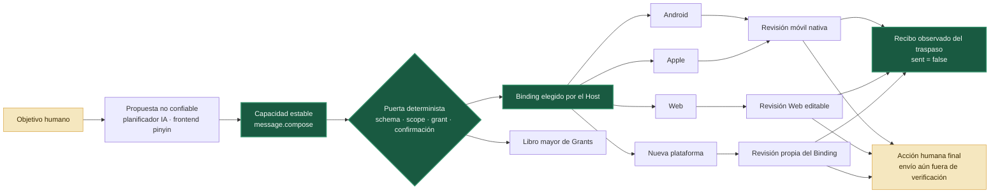

<p align="center">
  
</p>

<h1 align="center">Jidan</h1>

<p align="center">
  <strong>Un entorno de ejecución abierto y centrado en capacidades para acciones de IA entre aplicaciones y dispositivos.</strong><br />
  Un contrato de intención. Adaptadores de plataforma reemplazables. Control humano en el punto de confirmación final.
</p>

<p align="center">
  <a href="#-inicio-rápido"></a>
  <a href="profiles/message.compose.tool.json"></a>
  <a href="profiles/frontends/zh-Latn-pinyin.frontend.json"></a>
  <a href="docs/i18n/README.md"></a>
  <a href="CONTRIBUTING.md"></a>
</p>

<p align="center">
  <a href="README.md">English</a> ·
  <a href="README.zh-CN.md">简体中文</a> ·
  <a href="README.zh-TW.md">繁體中文</a> ·
  <a href="README.ja.md">日本語</a> ·
  <a href="README.es.md">Español</a>
</p>

> [!IMPORTANT]
> Jidan es un prototipo experimental: no es una distribución alternativa de Android, una herramienta para elevar privilegios ni un asistente listo para producción. Utilízalo con aplicaciones controladas, dispositivos de prueba y datos desechables.

## ✨ Por qué Jidan

El software móvil todavía se organiza en silos de aplicaciones. Un objetivo sencillo puede atravesar páginas, anuncios, permisos y API de plataforma incompatibles. Jidan explora una unidad más pequeña de software: un **contrato de capacidad** que un planificador no confiable puede proponer, pero que solo un host determinista puede autorizar y ejecutar.

```text
objetivo humano → acción semántica → contrato de capacidad → control de política
                → adaptador elegido → recibo del traspaso → acción humana
                                                       (el envío final no se verifica aún)
```

El objetivo a largo plazo no es crear «otra superaplicación», sino una capa de compatibilidad fina y abierta en la que Android, Apple, Web, HarmonyOS, Windows y futuros hosts puedan implementar la misma semántica estable de intención.

> **Se comparte la semántica, no la implementación.** El lenguaje natural y el pinyin son frontends reemplazables; JCL es el contrato de máquina; Kotlin, Swift, JavaScript y C/C++ son decisiones internas del host o adaptador. Un binding web sigue limitado por el sandbox del navegador. Consulta las [lecciones históricas y límites de la ruta](docs/06-history-lessons-and-route-guardrails-zh.md) (en chino).

## 🔌 Un contrato, múltiples adaptadores

[`message.compose`](profiles/message.compose.tool.json) es el primer perfil de Jidan Capability Layer (JCL). La primera serialización pública de JCL 0.1 utiliza un perfil Tool compatible con MCP; JCL no es un lenguaje nuevo ni queda ligado a un único transporte o modelo de sesión.

```python
from jidan.models import Step, TaskPlan

# El llamador propone una capacidad; no elige plataforma ni llama al adaptador.
plan = TaskPlan(
    id="compose-demo",
    goal="preparar un borrador de mensaje",
    steps=(Step(
        id="compose",
        capability="message.compose",
        arguments={"content": "Nos vemos a las tres."},
    ),),
)
# El host confiable valida, autoriza, confirma, elige el binding, ejecuta
# y registra el recibo.
```

| Contrato estable | Adaptador reemplazable | Evidencia actual |
|---|---|---|
| `message.compose` | Intent de Android | Plan basado solo en datos; existe un traspaso verificado a WeChat |
| `message.compose` | Atajo de Apple / Share Sheet | Plan basado solo en datos |
| `message.compose` | Borrador web editable | Plan basado solo en datos |
| `message.compose` | Adaptador comunitario | Registro local, sin lista blanca central de publicación |

Cada resultado expresa con precisión lo que ocurrió:

```json
{
  "state": "handoff_planned",
  "delivery": {
    "attempted": false,
    "sent": false,
    "verified": false
  },
  "nextAction": "user_review_and_send"
}
```

`handoff_planned` significa que existe un plan de traspaso; nunca se presenta como una interfaz ya abierta. Un selector de Android abierto y comprobado informa `handoff_opened`, pero la entrega sigue con `sent: false`: Jidan no elige al destinatario ni pulsa **Enviar**.

## 🔤 Frontend opcional de pinyin

El [perfil de frontend `zh-Latn-pinyin` 0.1](profiles/frontends/zh-Latn-pinyin.frontend.json) solo compila alias de control restringidos a la capacidad existente `message.compose`. Conserva literalmente el valor del payload: no lo traduce, translitera ni normaliza. Resolver un alias no concede autoridad, no confirma una acción y no ejecuta nada.

Se permiten alias sin tonos únicamente cuando identifican una sola entrada. Si falta una coincidencia o existe más de una, la compilación se rechaza sin adivinar. Este frontend no es bytecode, un lenguaje de programación ni un DSL nuevo; es una tabla determinista y versionada de alias hacia un contrato ya definido. Consulta el documento de [diseño, normalización y límites de seguridad](docs/05-jcl-pinyin-frontend-zh.md).

## 🧭 Arquitectura



## ✅ Estado actual

| Capa | Estado | Evidencia y límite |
|---|---:|---|
| Registro de capacidades y validación de esquemas | ✅ | Prototipo Python sin dependencias externas |
| Grafos de tareas, permisos con alcance y puerta de confirmación | ✅ | Preflight y ejecución deterministas |
| Rechazo persistente de repeticiones | ✅ | Libro mayor de permisos en SQLite |
| Recibos de ejecución encadenados por hash | ✅ | Registro de recibos del runtime |
| Android 17 AppFunctions | ✅ | Proveedor controlado de referencia y harness en vivo |
| Descubrimiento de superficies semánticas | ✅ | AppFunctions → RemoteInput → atajo → compartir público |
| Traspaso nativo verificado a WeChat | ✅ | Actividad exacta del selector; no elige destinatario ni pulsa Enviar |
| Perfil multiplataforma `message.compose` | 🧪 | Planes Android, iOS y Web; binding de Android verificado |
| Frontend opcional de pinyin 0.1 | 🧪 | Solo alias de control → `message.compose`; payload literal, sin autoridad ni ejecución; la ambigüedad se rechaza |
| Sistema operativo móvil de agentes listo para producción | 🗺️ | Todavía no se afirma |

El perfil multiplataforma `message.compose` sigue siendo experimental: Android, iOS y Web tienen planes de adaptador, mientras que la evidencia de apertura verificada disponible actualmente corresponde al binding de Android. Jidan todavía no afirma ser un sistema operativo de agentes móvil listo para producción.

## 🛡️ Seguridad por diseño

- **El planificador no es el límite de seguridad.** La salida del modelo se valida como datos no confiables.
- **Publicación abierta no significa ejecución ciega.** Cualquiera puede implementar un adaptador, pero cada dispositivo conserva sus propias decisiones de confianza, instalación, política y aislamiento.
- **Una sugerencia de destinatario no concede autoridad.** `message.compose.recipient` nunca se entrega al adaptador de plataforma.
- **Un adaptador no puede declarar el éxito.** El host genera el estado de entrega; no lo copia de la salida de terceros.
- **Un efecto ambiguo no se reintenta como si hubiera tenido éxito.** Los resultados desconocidos permanecen desconocidos y se registran de forma conservadora.
- **La persona conserva la última palabra.** Enviar, pagar, eliminar y cambiar ajustes de seguridad exige un límite explícito de confirmación.

Lee [SECURITY.md](SECURITY.md) antes de conectar un dispositivo real.

## 🚀 Inicio rápido

Ejecuta con Python 3.11 o posterior el conjunto completo de pruebas del prototipo, que no requiere dependencias externas:

```bash
cd prototype
python -m unittest discover -s tests -p "test_*.py"
python message_compose_demo.py
python pinyin_frontend_demo.py
python appfunctions_smoke.py
```

Las dos demostraciones de mensajes se detienen por defecto en `awaiting_confirmation`. `--simulate-approval` solo permite recorrer las etapas restantes del plan de datos local; queda marcado como simulación y no demuestra una confirmación real de la persona usuaria.

Desde la raíz del repositorio, valida los paquetes de idioma de Android:

```bash
python prototype/tools/check_locales.py
```

Con JDK 17 o posterior y Android SDK 37, compila la aplicación de referencia controlada:

```bash
cd reference-app
./gradlew :app:assembleDebug
```

En Windows utiliza `gradlew.bat`. Consulta la [guía del prototipo](prototype/README.md#windows-unicode-arguments) para las consideraciones sobre argumentos Unicode en PowerShell 5.1.

## 🗂️ Estructura del repositorio

```text
profiles/       perfiles de capacidad JCL compatibles con MCP
prototype/      núcleo, adaptadores, políticas, permisos, recibos y demostraciones
reference-app/  proveedor controlado de Android 17 AppFunctions
docs/           arquitectura, investigación, hoja de ruta e internacionalización
```

Los APK generados, imágenes de emulador, registros sin procesar de dispositivos, capturas de pantalla, recibos y bases SQLite se excluyen deliberadamente de Git.

## 🌍 Idiomas sin fragmentar el protocolo

Jidan mantiene el lenguaje humano separado del protocolo de máquina:

- el contenido Unicode puede atravesar JSON, grafos de tareas, ADB, AppFunctions, almacenamiento, lectura e interfaz sin transliteración ni normalización implícita;
- la interfaz Android de referencia contiene **23 paquetes semilla de configuración regional**, incluido árabe de derecha a izquierda;
- `memo: <content>` ofrece una entrada determinista independiente del idioma;
- los identificadores de capacidades, campos de esquema, permisos, hashes y valores de recibos permanecen como contratos ASCII estables;
- añadir traducciones de interfaz o adaptadores lingüísticos revisados no requiere bifurcar el protocolo.

> [!NOTE]
> El pinyin es únicamente una ortografía opcional para alias de control. Los tonos pueden omitirse solo si la resolución es única; cualquier colisión o ambigüedad se rechaza. El contenido del payload permanece literal y fuera de la resolución lingüística, por lo que el frontend no adquiere autoridad ni capacidad de ejecución.

Las traducciones semilla son un punto de partida abierto y no implican revisión por hablantes nativos. Consulta [Idiomas e internacionalización](docs/i18n/README.md) para ayudar a mejorarlas.

## 🤝 Colabora con Jidan

Son especialmente útiles:

- un nuevo adaptador de plataforma para `message.compose`;
- una prueba de conformidad que detecte falsos estados de éxito;
- la revisión por una persona hablante nativa de uno de los 23 paquetes semilla;
- un adaptador lingüístico restringido que emita identificadores semánticos existentes;
- pruebas reproducibles con una aplicación o un dispositivo controlados.

Empieza por [CONTRIBUTING.md](CONTRIBUTING.md) y la [hoja de ruta de 90 días](docs/04-90-day-execution-roadmap-zh.md).

> [!NOTE]
> Este README es una traducción inicial asistida por máquina y no afirma haber sido revisada por una persona hablante nativa. Si una traducción difiere, el [README en inglés](README.md) y los perfiles de capacidad legibles por máquina son las referencias técnicas canónicas.

## Licencia

Apache License 2.0. Consulta [LICENSE](LICENSE) y [NOTICE](NOTICE).
