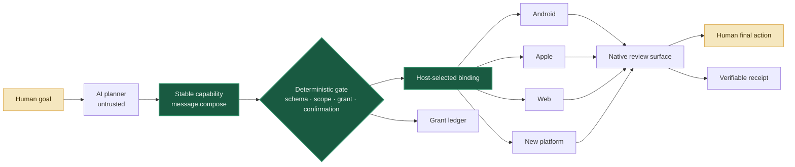

<p align="center">
  
</p>

<h1 align="center">Jidan</h1>

<p align="center">
  <strong>An open, capability-first runtime for AI actions across apps and devices.</strong><br />
  One intent contract. Replaceable platform bindings. Human control at the commit point.
</p>

<p align="center">
  <a href="#-quick-start"></a>
  <a href="profiles/message.compose.tool.json"></a>
  <a href="docs/i18n/README.md"></a>
  <a href="CONTRIBUTING.md"></a>
</p>

<p align="center">
  <a href="README.md">English</a> ·
  <a href="README.zh-CN.md">简体中文</a> ·
  <a href="README.zh-TW.md">繁體中文</a> ·
  <a href="README.ja.md">日本語</a> ·
  <a href="README.es.md">Español</a>
</p>

> [!IMPORTANT]
> Jidan is an experimental prototype, not a replacement Android distribution, a privilege-escalation tool, or a production assistant. Use controlled apps, test devices, and disposable data.

## ✨ Why Jidan

Mobile software is still organized around app silos. A simple goal crosses pages, ads, permissions, and incompatible platform APIs. Jidan explores a smaller unit of software: a **capability contract** that an untrusted planner can propose but only a deterministic host can authorize and execute.

```text
human goal → semantic action → capability contract → policy gate
           → selected adapter → native handoff → human commit → receipt
```

The long-term target is not “one more super app.” It is a thin, open compatibility layer where Android, Apple, Web, HarmonyOS, Windows, and future hosts can implement the same stable intent semantics.

## 🔌 One contract, many bindings

[`message.compose`](profiles/message.compose.tool.json) is the first Jidan Capability Layer (JCL) profile. JCL is an MCP Tool profile—not a new programming language or transport.

```python
from jidan.message_compose import planned_message_compose_binding
from jidan.registry import CapabilityRegistry

registry = CapabilityRegistry()
planned_message_compose_binding("ios").register(registry)  # host configuration

# The caller knows the capability, not the platform.
result = registry.invoke("message.compose", {"content": "See you at three."})
```

| Stable contract | Replaceable binding | Current proof |
|---|---|---|
| `message.compose` | Android Intent | Data-only plan; verified WeChat handoff available |
| `message.compose` | Apple Shortcut / Share Sheet | Data-only plan |
| `message.compose` | Web editable draft | Data-only plan |
| `message.compose` | Community adapter | Locally registered; no central publication whitelist |

Every result is explicit about reality:

```json
{
  "state": "handoff_planned",
  "delivery": {
    "attempted": false,
    "sent": false,
    "verified": false
  },
  "nextAction": "user_review_and_send"
}
```

`handoff_planned` never masquerades as an opened UI. A verified Android picker reports `handoff_opened`, but delivery still remains `sent: false` because Jidan never chooses the recipient or presses Send.

## 🧭 Architecture



## ✅ What works today

| Layer | Status | Evidence |
|---|---:|---|
| Capability registry and schema validation | ✅ | Dependency-free Python prototype |
| Task graphs, scoped grants, confirmation gate | ✅ | Deterministic preflight and execution |
| Durable replay rejection | ✅ | SQLite grant ledger |
| Hash-chained execution receipts | ✅ | Runtime receipt log |
| Android 17 AppFunctions | ✅ | Controlled reference provider and live harness |
| Semantic-surface discovery | ✅ | AppFunctions → RemoteInput → shortcut → public share |
| Verified WeChat native handoff | ✅ | Exact picker activity; no recipient selection or Send |
| Cross-platform `message.compose` profile | 🧪 | Android / iOS / Web plans; Android verified binding |
| Production-grade mobile agent OS | 🗺️ | Not claimed yet |

## 🛡️ Safety by construction

- **The planner is not the security boundary.** Model output is validated as untrusted data.
- **Open publication is not blind execution.** Anyone may implement an adapter; each device still owns local trust, installation, policy, and isolation.
- **Recipient hints are not authority.** `message.compose.recipient` is never passed to a platform binding.
- **Adapters cannot declare success.** Delivery state is generated by the host, not copied from third-party adapter output.
- **Ambiguous effects are not retried as success.** Unknown outcomes remain unknown and are receipted conservatively.
- **The user keeps the last word.** Send, pay, delete, and security-changing actions require an explicit commit boundary.

Read [SECURITY.md](SECURITY.md) before connecting a real device.

## 🚀 Quick start

Run the full dependency-free prototype test suite with Python 3.11+:

```bash
cd prototype
python -m unittest discover -s tests -p "test_*.py"
python message_compose_demo.py
python appfunctions_smoke.py
```

Validate all Android language packs:

```bash
python prototype/tools/check_locales.py
```

Build the controlled Android reference app with JDK 17+ and Android SDK 37:

```bash
cd reference-app
./gradlew :app:assembleDebug
```

On Windows, use `gradlew.bat`. For PowerShell 5.1 Unicode caveats, see the [prototype guide](prototype/README.md#windows-unicode-arguments).

## 🗂️ Repository map

```text
profiles/       MCP-compatible JCL capability profiles
prototype/      capability kernel, adapters, policy, grants, receipts, demos
reference-app/  controlled Android 17 AppFunctions provider
docs/           architecture, research, roadmap, internationalization
```

Generated APKs, emulator images, raw device logs, screenshots, receipts, and SQLite ledgers are deliberately excluded from Git.

## 🌍 Language without protocol fragmentation

Jidan separates human language from machine protocol:

- arbitrary Unicode content survives JSON, task graphs, ADB, storage, readback, and UI;
- the Android reference UI ships **23 seed locale packs**, including RTL Arabic;
- `memo: <content>` is a language-neutral deterministic entry point;
- capability IDs, schema fields, grants, hashes, and receipt values remain stable ASCII contracts;
- new UI translations and reviewed language adapters do not require a protocol fork.

Seed translations are an open-source starting point, not a claim of native review. See [Languages and internationalization](docs/i18n/README.md) to improve one.

## 🤝 Build with us

Useful contributions include:

- a new `message.compose` platform binding;
- a conformance fixture that catches false-success behavior;
- native review for one of the 23 seed locale packs;
- a constrained language adapter that emits existing semantic IDs;
- reproducible tests against a controlled app or device.

Start with [CONTRIBUTING.md](CONTRIBUTING.md) and the [90-day roadmap](docs/04-90-day-execution-roadmap-zh.md).

## License

Apache License 2.0. See [LICENSE](LICENSE) and [NOTICE](NOTICE).
