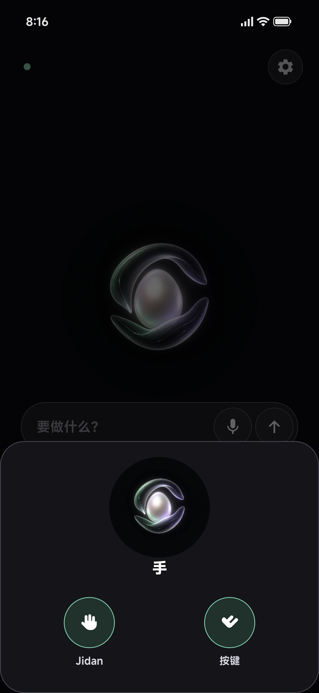
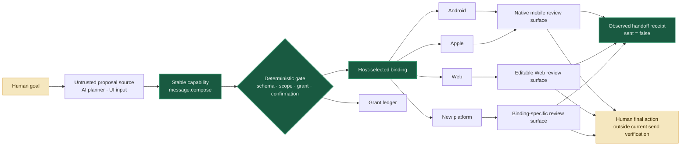

<p align="center">
  
</p>

<h1 align="center">Jidan</h1>

<p align="center">
  <strong>Real micro-actions first: make one useful step smaller, observable, and safe.</strong><br />
  Prepare locally. Hand off honestly. Leave the irreversible commit to the person.
</p>

<p align="center">
  <a href="reference-app/shell/README.md"></a>
  <a href="reference-app/ios-shell/README.md"></a>
  <a href="reference-app/windows-shell/README.md"></a>
  <a href="#-developer-quick-start"></a>
  <a href="profiles/message.compose.tool.json"></a>
  <a href="docs/09-alipay-micro-actions-and-protocol-lessons-zh.md"></a>
  <a href="docs/i18n/README.md"></a>
  <a href="CONTRIBUTING.md"></a>
</p>

<p align="center">
  <a href="README.md">English</a> ·
  <a href="README.zh-CN.md">简体中文</a> ·
  <a href="README.zh-TW.md">繁體中文</a> ·
  <a href="README.ja.md">日本語</a> ·
  <a href="README.es.md">Español</a>
</p>

> [!IMPORTANT]
> Jidan is an experimental prototype, not a replacement Android/iOS distribution, a privilege-escalation tool, or a production assistant. The Android lab now has three debug APKs: the Shell, an independently usable local daily-list app, and an isolated synthetic fixture. The repository also has a real SwiftUI iOS Shell and a native WPF Windows compatibility deck. None of these shells is store-signed, a default launcher, or an independent ROM/OS. Use controlled apps, test devices, and disposable data.

<p align="center">
  <a href="reference-app/shell/README.md"></a>
  <a href="reference-app/ios-shell/README.md"></a>
</p>

<p align="center"><strong>Do not question the doorway; stop before money moves.</strong></p>

## ✨ Why Jidan

Mobile software is still organized around app silos. A simple goal crosses pages, ads, permissions, and incompatible platform APIs. Jidan starts with a deliberately smaller promise: remove one concrete step, disclose exactly what changed, and stop before the human commit. A **capability contract** is the machine boundary that an untrusted planner may propose but only a deterministic Host may authorize and execute.

```text
human goal → semantic action → capability contract → policy gate
           → selected adapter → observed handoff receipt → human commit
                                                        (outside current send verification)
```

The roadmap begins with one useful micro-action, not a catalogue of apps. A thin compatibility layer across Android, Apple, Web, HarmonyOS, Windows, and future Hosts is a possible long-term result, not a version-one claim.

> **Share semantics, not implementations.** Natural language and UI inputs remain outside the JCL machine contract; Kotlin, Swift, JavaScript, and C/C++ remain Host or adapter choices. Web bindings still live inside the browser sandbox. The Pinyin 0.1 input experiment is frozen, not the project substrate. See the [historical design lessons and route guardrails](docs/06-history-lessons-and-route-guardrails-zh.md) (Chinese).

## 🎯 First micro-action: an Alipay handoff, not automatic payment

The implementation in this repository is intentionally smaller than a transfer assistant:

```text
say or tap “open Alipay” → Host validates one pinned target
                         → dispatch the allowlisted front door directly
                         → the person selects, verifies, authenticates, and pays in Alipay
```

The submit tap for this exact foreground command is the decision. Jidan classifies
it as `NAVIGATION`, not `WRITE`, and must not show a second card asking whether to
open the app. Any amount, recipient, QR, transfer, or payment wording is a
different high-risk action and is rejected before dispatch.

The current capability has an empty input object. It cannot receive a payee, account hint, amount, QR payload, URL, or order token. A future consumer Host may test a local, editable “transfer note,” but that artifact is not implemented here and must never enter this handoff's JCL arguments or adapter. Jidan must not inject an amount through an undocumented deep link, enter a password, press **Pay**, read a payment result, or retry an ambiguous outcome.

> [!WARNING]
> This is **not automatic payment**. The Shell only asks Android to open a package-scoped Alipay entry point and does not yet ship an independently reviewed Alipay signature manifest, so it is not a consumer-trusted Binding. The repository also contains a Host-pinned ADB Lab adapter and adversarial tests, but no accepted real-Alipay-device run is claimed. An independent identity review and a multi-device evidence matrix are still required.

The status words must remain literal:

| Observable fact | Honest state |
|---|---|
| A card or data plan exists; no external UI is claimed | `handoff_planned` |
| A future retail Host has submitted an Alipay front-door request | `handoff_requested`; this is not success |
| Android accepts that launch request | `handoff_dispatched`; the foreground UI is still unverified |
| The Lab Binding observes one allowlisted component as both resumed Activity and focused Window twice | `handoff_opened` |
| Current Alipay Lab handoff | `paymentAttemptedByJidan=false`, `paid=false`, `committed=false`, `verified=false` |

See the Chinese product and protocol note, [Alipay micro-actions, protocol boundaries, and JCL corrections](docs/09-alipay-micro-actions-and-protocol-lessons-zh.md).
The controlled implementation lives in [`android_handoff.py`](prototype/jidan/android_handoff.py), [`alipay_handoff.py`](prototype/jidan/alipay_handoff.py), and the [direct-navigation Lab harness](prototype/alipay_handoff_live.py); usage and trust requirements are in the [prototype guide](prototype/README.md#alipay-fixed-front-door-handoff-controlled-lab-only).

## 🖐️ Second step: connect a verifiable brain to the hand

Jidan now has one real Android accessibility loop:

```text
observe an owned synthetic page → make a five-step plan → execute one step
                                → observe and verify → hash-chain a receipt
```

The no-network, no-account, no-real-money fixture exercises synthetic payee, amount, password, OTP, and commit steps. Sensitive capabilities were not deleted: they execute fully in `SANDBOX`. A separate, specification-only `SHADOW` contract can describe third-party-app plans while fixing executor attempts to zero; the Android third-party observer is not connected and no executor is registered for that lane.

The hand is now replaceable: **JCL is the task contract and brain, MCP is the socket, and a Hand Provider is the interchangeable actuator.** The Host—not MCP arguments or provider self-description—decides which provider is trusted. The built-in accessibility hands are limited to two pinned owned packages: the synthetic sandbox and the local daily app. The audited automation APK remains a visible `HANDOFF_ONLY` candidate and cannot enter executor selection. Its public Quick Development UI was exercised on Android 17: the target save worked, but the step list stayed empty and no replayable script was produced. See the [provider manifests](profiles/providers/), [read-only discovery tool](profiles/experimental/android.hand.providers.inspect.tool.json), and [live daily-action report](docs/11-daily-note-cross-app-hand-zh.md). The Android hand still uses an internal Kotlin mapping—there is no public MCP or JSON execution endpoint yet.

## 📝 Third step: use the hand for one reversible daily action

The first useful cross-app write is deliberately small:

```text
tap “记小事” or enter “记下明天买鸡蛋”
  → Shell pins the owned app's signer, version, contract, and no-network status
  → a short-lived accessibility session fills one semantic input and taps Save
  → the daily app commits locally and rejects an exact request replay
  → the hand observes the saved digest, writes a receipt, and returns to Shell
```

The **小事清单** app also works by itself: add an item, mark it complete, undo it, or clear completed items. Its list is stored only on the device and the app has no `INTERNET` permission. The note text belongs in that list; Shell and accessibility receipts retain its digest rather than another plaintext copy. This is a real write to an owned, reversible local surface—not proof that Jidan can control arbitrary third-party apps.

Android 0.4 uses three visual actions: **Pay / Hand / Note**. The audited compatibility hand now lives inside the Hand Center instead of occupying the home screen as an external product. System Settings and the five-step synthetic lab remain typed or spoken commands. See the [plain-language Chinese walkthrough](docs/11-daily-note-cross-app-hand-zh.md).

## 🔌 One contract, many bindings

[`message.compose`](profiles/message.compose.tool.json) is the first Jidan Capability Layer (JCL) profile. JCL 0.1's first public serialization uses an MCP-compatible Tool profile; JCL itself is neither a new programming language nor tied to one transport or session model.

```python
from jidan.models import Step, TaskPlan

# The caller proposes a capability, not a platform or an adapter call.
plan = TaskPlan(
    id="compose-demo",
    goal="prepare a message draft",
    steps=(Step(
        id="compose",
        capability="message.compose",
        arguments={"content": "See you at three."},
    ),),
)
# A trusted Host validates, grants, confirms, selects a binding, executes,
# and writes the receipt. See prototype/message_compose_demo.py.
```

| Stable contract | Replaceable binding | Current proof |
|---|---|---|
| `message.compose` | Android Intent | Data-only plan; verified WeChat handoff available |
| `message.compose` | Apple Shortcut / Share Sheet | Data-only plan |
| `message.compose` | Web editable draft | Data-only plan |
| `message.compose` | Community adapter | Locally registered; no central publication whitelist |

Every result is explicit about reality:

```json
{
  "state": "handoff_planned",
  "delivery": {
    "attempted": false,
    "sent": false,
    "verified": false
  },
  "nextAction": "user_review_and_send"
}
```

`handoff_planned` never masquerades as an opened UI. A verified Android picker reports `handoff_opened`, but delivery still remains `sent: false` because Jidan never chooses the recipient or presses Send.

> [!NOTE]
> The Pinyin Frontend 0.1 experiment was frozen on 2026-08-02. Its code, Profile,
> demo, and tests remain for compatibility and reproduction, but it is no longer
> an active route or quick-start feature. New syntax and aliases are out of scope.

## 🧭 Architecture



## ✅ What works today

| Layer | Status | Evidence |
|---|---:|---|
| Capability registry and schema validation | ✅ | Dependency-free Python prototype |
| Task graphs, scoped grants, confirmation gate | ✅ | Deterministic preflight and execution |
| Durable replay rejection | ✅ | SQLite grant ledger |
| Hash-chained execution receipts | ✅ | Runtime receipt log |
| Capability-definition authorization | ✅ | Grants pin Schema, effect, and adapter identity |
| Discovery error taxonomy | ✅ | Pure classifier + unit tests; real connection/fallback integration is pending |
| Android 17 AppFunctions | ✅ | Controlled reference provider and live harness |
| Semantic-surface discovery | ✅ | AppFunctions → RemoteInput → shortcut → public share |
| Controlled WeChat native handoff | 🧪 | ADB/device harness verifies the exact picker; no recipient selection or Send |
| [Direct Alipay front-door navigation](profiles/app.open.alipay_frontdoor.tool.json) | 🧪 Lab | Empty-input `NAVIGATION / DIRECT` Profile + adversarial tests; real-device acceptance pending; no payment automation |
| [Android accessibility hand + brain lab](docs/10-android-hand-brain-lab-zh.md) | 🧪 Lab | Five synthetic execute/verify steps in an owned no-network APK; raw inputs are excluded from Jidan plans, receipts, and fixture storage; real-app SHADOW remains specification-only |
| [Owned daily-note cross-app write](docs/11-daily-note-cross-app-hand-zh.md) | 🧪 Lab | Full Android 17 first-run evidence: system enablement, two verified semantic steps, synchronous local save, return to Shell, and persistence after reopening |
| Cross-platform `message.compose` profile | 🧪 | Android / iOS / Web plans; Android verified binding |
| Conformance Lab: Nine Lights | 🧪 Lab | Python Runtime/Receipts + independent JS Host; not a user product |
| Pinyin Frontend 0.1 | ⏸️ | Frozen compatibility experiment; no new syntax or aliases |
| [Jidan Shell 0.4 Android experience](reference-app/shell/README.md) | 🧪 | Visual Hand Center, verified embedded-companion installer for authorized local builds, and hash-chained owned actions; not store-signed, a default launcher, or a ROM |
| [Jidan iOS Shell 0.1](reference-app/ios-shell/README.md) | 🧪 | SwiftUI + Apple Speech + `NAVIGATION / DIRECT`; built, tested, and captured on a remote Apple simulator; not an independent Apple OS |
| [JidanOS Windows Shell 0.1](reference-app/windows-shell/README.md) | 🧪 | Native WPF system deck; real EXE/ADB routes plus a bounded clean-room ARM64 fixture; not a full cross-platform OS or Apple runtime |
| Production-grade mobile agent OS | 🗺️ | Not claimed yet |

## 🛡️ Safety by construction

- **The planner is not the security boundary.** Model output is validated as untrusted data.
- **Open publication is not blind execution.** Anyone may implement an adapter; each device still owns local trust, installation, policy, and isolation.
- **Recipient hints are not authority.** `message.compose.recipient` is never passed to a platform binding.
- **Input frontends are not authority.** Language or UI input cannot grant, execute, select a platform, or rewrite approved payload data.
- **Adapters cannot declare success.** Delivery state is generated by the host, not copied from third-party adapter output.
- **Authorization binds more than a name.** A Grant pins the effective capability definition; changed Schema, effect, or adapter identity requires a new Grant.
- **Ambiguous effects are not retried as success.** Unknown outcomes remain unknown and are receipted conservatively.
- **The user keeps the last word.** Send, pay, delete, and security-changing actions require an explicit commit boundary.

Read [SECURITY.md](SECURITY.md) before connecting a real device.

## 🚀 Developer quick start

Run the full dependency-free prototype test suite with Python 3.11+:

```bash
cd prototype
python -m unittest discover -s tests -p "test_*.py"
python message_compose_demo.py
python appfunctions_smoke.py
```

The message demo stops at `awaiting_confirmation` by default. Its
`--simulate-approval` option is labeled as a simulation and is not evidence of
a user's confirmation. This is a developer quick start, not an ordinary-user
mobile onboarding flow. Alipay is not part of the runnable product path yet.

Validate all Android language packs:

```bash
python prototype/tools/check_locales.py
```

Build the controlled Android reference app with JDK 17+ and Android SDK 37:

```bash
cd reference-app
./gradlew :app:assembleDebug
```

On Windows, use `gradlew.bat`. For PowerShell 5.1 Unicode caveats, see the [prototype guide](prototype/README.md#windows-unicode-arguments).

Build and install the Jidan Shell, local daily app, and isolated fixture:

```bash
cd reference-app
./gradlew :shell:testDebugUnitTest :shell:assembleDebug :shell:lintDebug \
  :daily-demo:testDebugUnitTest :daily-demo:assembleDebug :daily-demo:lintDebug \
  :accessibility-sandbox:assembleDebug :accessibility-sandbox:lintDebug
adb install -r -t daily-demo/build/outputs/apk/debug/daily-demo-debug.apk
adb install -r -t accessibility-sandbox/build/outputs/apk/debug/accessibility-sandbox-debug.apk
adb install -r -t shell/build/outputs/apk/debug/shell-debug.apk
```

In **Jidan Shell 0.4**, the home screen is visual: **Pay / Hand / Note**. The Hand Center shows the owned Jidan hand and the verified compatibility companion. “Note” still runs “记下明天买鸡蛋”; speech and typing share one input. See the [three-minute walkthrough](docs/11-daily-note-cross-app-hand-zh.md) and [Shell guide](reference-app/shell/README.md).

Build and observe the Apple version on a Mac:

```bash
cd reference-app/ios-shell
xcodegen generate
xcodebuild test -project JidanIOS.xcodeproj -scheme JidanIOS \
  -destination 'platform=iOS Simulator,name=iPhone 16,OS=18.5'
```

Windows cannot run Apple Simulator. The checked [`iOS Shell CI`](.github/workflows/ios-shell.yml) boots an iPhone 16 on an Apple runner, captures the home/direct-navigation screens, and uploads the Simulator app. See the [iOS Shell guide](reference-app/ios-shell/README.md).

Build and test the native Windows system deck on Windows 10/11:

```powershell
cd reference-app\windows-shell
.\build.cmd
$results = Join-Path $PWD 'test-results.txt'
$process = Start-Process .\JidanOS.exe -ArgumentList '--test', $results -Wait -PassThru
Get-Content $results
if ($process.ExitCode -ne 0) { throw "Tests failed: $($process.ExitCode)" }
```

The checked [`Windows Shell CI`](.github/workflows/windows-shell.yml) rebuilds the executable on `windows-latest`, runs all headless checks, and uploads a ZIP artifact without PDB files. See the [Windows Shell guide](reference-app/windows-shell/README.md) for the exact compatibility and safety boundaries.

## 🗂️ Repository map

```text
profiles/       MCP-compatible JCL capabilities and conformance vectors
prototype/      capability kernel, adapters, policy, grants, receipts, demos
reference-app/  Android provider/shell + SwiftUI iOS Shell + native WPF Windows Shell
docs/           architecture, research, roadmap, internationalization
```

Generated APKs, emulator images, raw device logs, runtime receipts, and SQLite ledgers are excluded from Git; documentation keeps only curated UI screenshots.

## 🧪 Conformance Lab

Nine Lights remains in the repository as a developer fixture for one narrow
question: can independent Python and JavaScript Hosts reproduce the same
stateless transitions and [conformance vectors](profiles/conformance/game.ninelights.vectors.json)
without sharing a Runtime?

It is **not** a Jidan user feature, a universal game language, mobile app
automation, or evidence that Android and iOS are supported. Its Web UI, Windows
GUI, build script, Profiles, and tests remain available for reproducibility, but
they are intentionally outside the homepage badges and product quick start. See
the [Conformance Lab scope note](docs/07-universal-game-spike-zh.md) and the
[prototype guide](prototype/README.md#nine-lights-conformance-spike).

## 🌍 Language without protocol fragmentation

Jidan separates human language from machine protocol:

- arbitrary Unicode content survives JSON, task graphs, ADB, storage, readback, and UI;
- the Android reference UI ships **23 seed locale packs**, including RTL Arabic;
- `memo: <content>` is a language-neutral deterministic entry point;
- the frozen `zh-Latn-pinyin` experiment remains available only for compatibility and reproducibility;
- capability IDs, schema fields, grants, hashes, and receipt values remain stable ASCII contracts;
- new UI translations and reviewed language adapters do not require a protocol fork.

Seed translations are an open-source starting point, not a claim of native review. See [Languages and internationalization](docs/i18n/README.md) to improve one.

## 🤝 Build with us

Useful contributions include:

- a new `message.compose` platform binding;
- a conformance fixture that catches false-success behavior;
- native review for one of the 23 seed locale packs;
- a constrained language adapter that emits existing semantic IDs;
- reproducible tests against a controlled app or device.

Start with [CONTRIBUTING.md](CONTRIBUTING.md), the [micro-action and Alipay boundary](docs/09-alipay-micro-actions-and-protocol-lessons-zh.md), the [90-day roadmap](docs/04-90-day-execution-roadmap-zh.md), and the [seven-day protocol review](docs/08-seven-day-protocol-review-zh.md) (Chinese).

## License

Apache License 2.0. See [LICENSE](LICENSE) and [NOTICE](NOTICE).
