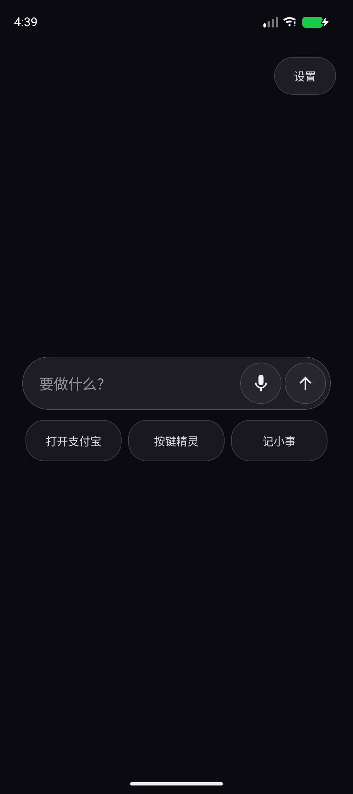
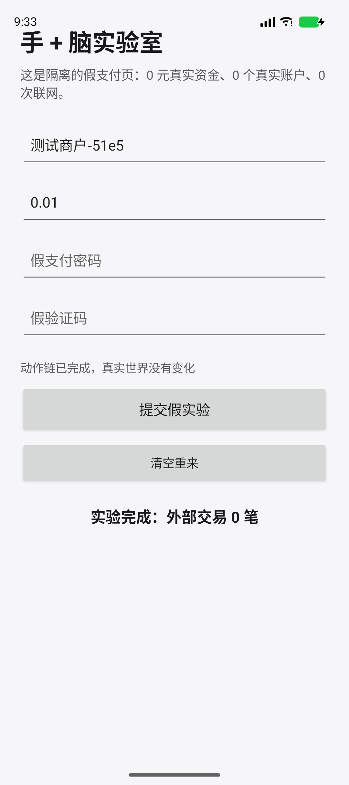
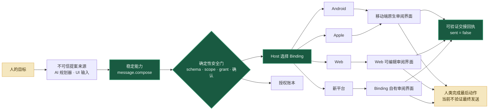

<p align="center">
  
</p>

<h1 align="center">Jidan</h1>

<p align="center">
  <strong>真实微动作优先：先把一件小事做少一步、做得可见、做得安全。</strong><br />
  本地准备，如实交接；不可逆的最后一步仍由人决定。
</p>

<p align="center">
  <a href="docs/11-daily-note-cross-app-hand-zh.md"></a>
  <a href="reference-app/ios-shell/README.md"></a>
  <a href="reference-app/windows-shell/README.md"></a>
  <a href="#-开发者快速开始"></a>
  <a href="profiles/message.compose.tool.json"></a>
  <a href="docs/09-alipay-micro-actions-and-protocol-lessons-zh.md"></a>
  <a href="docs/i18n/README.md"></a>
  <a href="CONTRIBUTING.md"></a>
</p>

<p align="center">
  <a href="README.md">English</a> ·
  <a href="README.zh-CN.md">简体中文</a> ·
  <a href="README.zh-TW.md">繁體中文</a> ·
  <a href="README.ja.md">日本語</a> ·
  <a href="README.es.md">Español</a>
</p>

> [!IMPORTANT]
> Jidan 仍是实验原型，不是完整 Android/iOS 发行版、提权工具或可托管重要事务的生产助手。Android 实验包现在有三只调试 APK：Shell、可以单独使用的本地“小事清单”，以及隔离的合成实验页。仓库另有真实 SwiftUI iOS Shell 与原生 WPF Windows 兼容卡组。以上体验壳都不是应用商店签名产品、默认桌面或独立 ROM/OS。请只连接受控 App、测试设备和可丢弃数据。

<p align="center">
  <a href="reference-app/shell/README.md"></a>
  <a href="reference-app/ios-shell/README.md"></a>
</p>

<p align="center"><strong>进门不盘问，动钱要停下。</strong></p>

## ✨ 为什么做 Jidan

今天的软件仍以 App 围墙为中心：一个简单目标要穿过页面、广告、权限和互不兼容的平台接口。Jidan 先收窄承诺：真实减少一个步骤，明确展示刚才发生了什么，并在人的提交点之前停下。一份**能力契约**是机器边界——AI 可以提出调用建议，但只有确定性的 Host 才能授权和执行。

```text
人的目标 → 语义动作 → 能力契约 → 策略门
         → 已选择的适配器 → 可验证交接回执 → 人类提交
                                              （当前不验证最终发送）
```

路线从一个有用的微动作开始，而不是先列出一长串 App。让 Android、Apple、Web、HarmonyOS、Windows 与未来 Host 共享一层薄语义，是可能的长期结果，不是第一版承诺。

> **统一语义，不统一实现。** 自然语言与 UI 输入位于 JCL 机器契约之外；Kotlin、Swift、JavaScript、C/C++ 只是 Host 或 Adapter 的实现选择；Web Binding 仍受浏览器沙箱限制。拼音 0.1 已冻结，不是项目底层。参见[历史镜鉴与路线护栏](docs/06-history-lessons-and-route-guardrails-zh.md)。

## 🎯 第一个微动作：支付宝安全接力，不是自动付款

当前仓库实现的动作，刻意比“转账助手”更小：

```text
说出或点选“打开支付宝” → Host 校验一个固定目标
                       → 直接分派 allowlist 中的 front door
                       → 用户在支付宝里选人、核名、认证并付款
```

提交这条明确的前台命令，本身就是用户决定。Jidan 将它标为 `NAVIGATION`，而不是
`WRITE`，不能再弹一张“是否打开”的同义确认卡。只要句子出现收款人、金额、二维码、
转账或付款，它就变成另一类高风险动作，必须在分派前拒绝。

当前 Capability 的输入是空对象，不能接收收款人、账号线索、金额、二维码、URL 或订单令牌。未来消费者 Host 可以另行验证本地、可编辑的“转账小抄”，但该功能尚未实现，而且它的数据绝不能进入本 Handoff 的 JCL 参数或 Adapter。Jidan 不能通过未公开深链注入金额，不能输入密码、点击**付款**、读取支付结果，也不能在结果不明时自动重试。

> [!WARNING]
> 这**不是自动付款**。Shell 只会向 Android 请求打开包名固定的支付宝入口，尚未内置经独立审查的支付宝签名身份清单，因此不能把它当作消费者级可信 Binding。仓库另有 Host 固定身份的支付宝 ADB Lab Adapter 与对抗测试，但没有宣称真实支付宝设备验收已通过。独立审查清单与多设备证据矩阵仍未完成。

状态词必须按字面表达现实：

| 可观察事实 | 诚实状态 |
|---|---|
| 已生成动作卡或数据计划，未声称外部界面已打开 | `handoff_planned` |
| 未来零售 Host 已提交支付宝首页启动请求 | `handoff_requested`；这还不是成功 |
| Android 接受了启动请求 | `handoff_dispatched`；仍未验证前台界面 |
| Lab Binding 连续两次观察到 allowlist component 同时是 resumed Activity 与 focused Window | `handoff_opened` |
| 当前支付宝 Lab Handoff | `paymentAttemptedByJidan=false`、`paid=false`、`committed=false`、`verified=false` |

产品流程、不可自动化边界与协议修正规则见[《支付宝微动作、协议边界与 JCL 修正规则》](docs/09-alipay-micro-actions-and-protocol-lessons-zh.md)。
受控实现见 [`android_handoff.py`](prototype/jidan/android_handoff.py)、[`alipay_handoff.py`](prototype/jidan/alipay_handoff.py) 与[直接导航 Lab Harness](prototype/alipay_handoff_live.py)；运行方法和本地信任要求见[原型说明](prototype/README.md#alipay-fixed-front-door-handoff-controlled-lab-only)。

## 🖐️ 第二步：给“手”接上能核验的“脑”

Jidan 现在有了一条真实 Android 无障碍实验链：

```text
观察自有假页面 → 生成 5 步计划 → 一次执行一步
              → 每步重新观察并核验 → 写哈希回执
```

它能在无网络、无账户、无真实资金的实验 APK 中填写假收款人、假金额、假密码和假验证码，再完成一次合成提交。敏感能力没有从协议删掉；它们先在 `SANDBOX` 完整执行。真实第三方 App 目前只有独立的 `SHADOW` 规格契约：Android 观察器尚未接入，该通道也没有注册执行器，不能把“想点”冒充“点过”。当前 Android“手”仍使用内部 Kotlin 映射，还没有对外注册 MCP 或 JSON 执行端点。

这次同时把“手”从协议里拆了出来：**JCL 是任务卡和家规，MCP 是插座，Hand Provider 才是可更换的手。** 当前路线不是等待某家官方接口开放，而是先把自研内置手培养成默认底座；第三方自动化工具用来学习、比较和兼容，不掌握项目命门。本机 Host 决定哪只手可信；MCP 参数和 Provider 自述都不能给自己提权。内置无障碍手目前只准碰两个身份固定的自有包：合成沙盒与本地“小事清单”；按键精灵仍以 `HANDOFF_ONLY` 候选身份可见、可打开，但不能进入执行器选择。参见 [`Hand Provider` 清单](profiles/providers/)与[只读发现工具](profiles/experimental/android.hand.providers.inspect.tool.json)。



提供的按键精灵 APK 已完成离线静态审计，并在隔离 Android 17 模拟器走过公开“快捷开发”界面。它能打开并真实操作小事清单，但本次录制步骤栏始终为空，未生成可回放脚本；因此仍是 `HANDOFF_ONLY` 候选，没有把私有接口接进 JCL。动态证据见[小事清单实战](docs/11-daily-note-cross-app-hand-zh.md)，完整审计与社区踩坑见[《Android 手 + 脑实验》](docs/10-android-hand-brain-lab-zh.md)。

## 📝 第三步：让这只手真正记下一件小事

第一条有日常价值的跨 App 写入被刻意做得很小：

```text
点“记小事”或输入“记下明天买鸡蛋”
  → Shell 核对自有 App 的签名、版本、实验契约与无网络状态
  → 短时无障碍会话填写一个语义输入框，再点一次保存
  → 小事清单同步落盘，并拒绝同一 requestId 的重复写入
  → 鸡蛋重新观察 saved 摘要、写回执，然后返回 Shell
```

**小事清单**也能脱离 Shell 单独使用：新增事项、标为完成、撤销完成、清空已完成。清单只存在本机，App 没有 `INTERNET` 权限。事项原文应该保存在清单里；Shell 与无障碍回执只保留摘要，不再落一份原文。这是真正写入自有、可撤销本地 App 的动作，但不是“已经能随便操控第三方 App”的证据。

Android 首页现在恰好有三个快捷键：**打开支付宝、打开已审计的按键精灵候选、记小事**。系统设置和五步合成“手脑实验”仍可用文字或语音命令触发，但不占首页按钮。用户点下这条明确命令就是本次启动授权，Jidan 不再加一张同义确认卡。普通人可直接看[《三分钟实战：让鸡蛋跨 App 记下一件小事》](docs/11-daily-note-cross-app-hand-zh.md)。

## 🔌 一份契约，多端实现

[`message.compose`](profiles/message.compose.tool.json) 是第一份 Jidan Capability Layer（JCL）Profile。JCL 0.1 的首个公开序列化采用与 MCP 兼容的 Tool Profile；JCL 本身不是新编程语言，也不绑定某一种传输或会话模型。

```python
from jidan.models import Step, TaskPlan

# 上层只提出能力，不选择平台，也不直接调用 Adapter。
plan = TaskPlan(
    id="compose-demo",
    goal="准备一份消息草稿",
    steps=(Step(
        id="compose",
        capability="message.compose",
        arguments={"content": "下午三点见。"},
    ),),
)
# 可信 Host 继续完成校验、授权、确认、Binding 选择、执行和回执。
# 完整流程见 prototype/message_compose_demo.py。
```

| 稳定契约 | 可替换 Binding | 当前证据 |
|---|---|---|
| `message.compose` | Android Intent | 数据计划；已有经验证的微信原生交接 |
| `message.compose` | Apple Shortcut / Share Sheet | 数据计划 |
| `message.compose` | Web 可编辑草稿 | 数据计划 |
| `message.compose` | 社区 Adapter | 本地注册，不需要中央发布白名单 |

所有结果都必须如实表达现实状态：

```json
{
  "state": "handoff_planned",
  "delivery": {
    "attempted": false,
    "sent": false,
    "verified": false
  },
  "nextAction": "user_review_and_send"
}
```

`handoff_planned` 绝不能冒充“界面已经拉起”。只有真实验证过 Android Picker 才能报告 `handoff_opened`；即便如此，发送仍是 `false`，因为 Jidan 不选择联系人，也不点击发送。

> [!NOTE]
> Pinyin Frontend 0.1 实验已于 2026-08-02 冻结。代码、Profile、演示与测试暂时保留用于兼容和复现，但不再属于活跃路线或快速开始；不接受新语法与新别名。

## 🧭 架构



## ✅ 今天已经能做什么

| 层级 | 状态 | 证据 |
|---|---:|---|
| 能力注册与 Schema 校验 | ✅ | 无第三方依赖的 Python 原型 |
| 任务图、限权 Grant、确认门 | ✅ | 确定性预检与执行 |
| 持久重放拦截 | ✅ | SQLite 授权账本 |
| 哈希链执行回执 | ✅ | Runtime Receipt Log |
| 能力定义指纹授权 | ✅ | Grant 绑定 Schema、风险与 Adapter；定义变化即失效 |
| 发现错误分层 | ✅ | 已落地纯分类器与单测；真实连接和回退集成仍待实现 |
| Android 17 AppFunctions | ✅ | 受控 Provider 与真机 Harness |
| 语义表面发现 | ✅ | AppFunctions → RemoteInput → Shortcut → 公开分享 |
| 受控微信原生交接 | 🧪 | ADB/真机 Harness 验证准确 Picker；不选人、不发送 |
| [支付宝 front-door 直接导航](profiles/app.open.alipay_frontdoor.tool.json) | 🧪 Lab | 空输入 `NAVIGATION / DIRECT` Profile + 对抗测试；真机验收待完成；没有自动付款 |
| [Android 手 + 脑无障碍实验](docs/10-android-hand-brain-lab-zh.md) | 🧪 Lab | 自有无网络 APK 中 5 步合成执行/核验；输入原文不进入 Jidan 计划、回执或实验应用存储；真实 App 的 SHADOW 仍只有规格 |
| [自有小事清单跨 App 写入](docs/11-daily-note-cross-app-hand-zh.md) | 🧪 Lab | Android 17 首次授权整链实跑：两步语义动作均核验、同步本机保存、返回 Shell、重开仍存在 |
| 跨端 `message.compose` Profile | 🧪 | Android / iOS / Web 计划；Android 已验证 Binding |
| Conformance Lab：Nine Lights | 🧪 Lab | Python Runtime/Receipt + 独立 JS Host；不是用户产品 |
| Pinyin Frontend 0.1 | ⏸️ | 冻结兼容实验；不新增语法或别名 |
| [Jidan Shell 0.3 Android 体验包](reference-app/shell/README.md) | 🧪 | 可安装调试 APK；已有 Android 17 模拟器截图与哈希链回执；不是商店签名产品、默认桌面或 ROM |
| [Jidan iOS Shell 0.1](reference-app/ios-shell/README.md) | 🧪 | SwiftUI + Apple Speech + `NAVIGATION / DIRECT`；由苹果远程模拟器构建、测试并截图；不是独立 Apple OS |
| [JidanOS Windows Shell 0.1](reference-app/windows-shell/README.md) | 🧪 | 原生 WPF 系统卡组；真实 EXE/ADB 路由与边界明确的 clean-room ARM64 样本；不是完整跨平台 OS 或 Apple 运行时 |
| 生产级移动 Agent OS | 🗺️ | 尚未宣称完成 |

## 🛡️ 把安全写进结构

- **AI 规划器不是安全边界：**模型输出始终按不可信数据验证。
- **开放发布不等于盲目执行：**任何人都能实现 Adapter，但本机仍掌握安装信任、策略、隔离与撤销。
- **收件人提示不是授权：**`message.compose.recipient` 永远不会传给平台 Binding。
- **输入 Frontend 不是授权：**语言或 UI 输入不能发 Grant、执行、选择平台或改写已经确认的正文。
- **Adapter 无权宣布成功：**发送状态由 Host 生成，不照抄第三方返回值。
- **授权不只绑定名字：**Grant 绑定能力定义指纹；同名能力的 Schema、风险或 Adapter 变化后必须重新授权。
- **模糊结果不会被重试成成功：**未知就是未知，并保守写入回执。
- **用户拥有最后一步：**发送、支付、删除和安全设置必须具有明确提交边界。

连接真实设备前请阅读 [SECURITY.md](SECURITY.md)。

## 🚀 开发者快速开始

使用 Python 3.11+ 运行完整的无依赖原型测试与跨端演示：

```bash
cd prototype
python -m unittest discover -s tests -p "test_*.py"
python message_compose_demo.py
python appfunctions_smoke.py
```

消息演示默认停在 `awaiting_confirmation`；`--simulate-approval` 会明确标成模拟批准，不能当作用户真的确认过。这是开发者快速开始，不是普通用户的移动端上手流程；支付宝目前也不在可运行产品路径中。

检查全部 Android 语言包：

```bash
python prototype/tools/check_locales.py
```

使用 JDK 17+ 和 Android SDK 37 构建受控 Reference App：

```bash
cd reference-app
./gradlew :app:assembleDebug
```

Windows 请用 `gradlew.bat`。PowerShell 5.1 的 Unicode 注意事项见[原型说明](prototype/README.md#windows-unicode-arguments)。

构建并安装 Jidan Shell、本地小事清单与隔离实验包：

```bash
cd reference-app
./gradlew :shell:testDebugUnitTest :shell:assembleDebug :shell:lintDebug \
  :daily-demo:testDebugUnitTest :daily-demo:assembleDebug :daily-demo:lintDebug \
  :accessibility-sandbox:assembleDebug :accessibility-sandbox:lintDebug
adb install -r -t daily-demo/build/outputs/apk/debug/daily-demo-debug.apk
adb install -r -t accessibility-sandbox/build/outputs/apk/debug/accessibility-sandbox-debug.apk
adb install -r -t shell/build/outputs/apk/debug/shell-debug.apk
```

打开 **Jidan Shell** 后，首页三个快捷键是**打开支付宝、按键精灵、记小事**。“记小事”会执行“记下明天买鸡蛋”：如果 Android 第一次要求无障碍授权，请打开**鸡蛋辅助操作**并返回；原动作会自动继续，不必再点第二次。保存经页面核验后，系统返回 Shell，Shell 显示“已经记下”。“打开系统设置”和“开始手脑实验”仍可在输入框键入或说出。语音转文字由手机当前的语音服务提供。详见[三分钟实战](docs/11-daily-note-cross-app-hand-zh.md)与 [Shell 说明](reference-app/shell/README.md)。

观察并验证苹果版本：

```bash
cd reference-app/ios-shell
xcodegen generate
xcodebuild test -project JidanIOS.xcodeproj -scheme JidanIOS \
  -destination 'platform=iOS Simulator,name=iPhone 16,OS=18.5'
```

Windows 没有 Apple Simulator；仓库的 [`iOS Shell CI`](.github/workflows/ios-shell.yml) 会在苹果机器上自动启动 iPhone 16、截取主页与直接导航后的画面，并上传 Simulator App。细节见 [iOS Shell 说明](reference-app/ios-shell/README.md)。

在 Windows 10/11 构建并验证原生系统卡组：

```powershell
cd reference-app\windows-shell
.\build.cmd
$results = Join-Path $PWD 'test-results.txt'
$process = Start-Process .\JidanOS.exe -ArgumentList '--test', $results -Wait -PassThru
Get-Content $results
if ($process.ExitCode -ne 0) { throw "Tests failed: $($process.ExitCode)" }
```

仓库的 [`Windows Shell CI`](.github/workflows/windows-shell.yml) 会在 `windows-latest` 重新构建程序、运行全部无头检查，并上传不含 PDB 的 ZIP 成品。准确兼容范围与安全边界见 [Windows Shell 说明](reference-app/windows-shell/README.md)。

## 🗂️ 仓库地图

```text
profiles/       与 MCP 兼容的 JCL 能力及一致性向量
prototype/      能力内核、Adapter、策略、授权、回执与演示
reference-app/  Android Provider/Shell + SwiftUI iOS Shell + 原生 WPF Windows Shell
docs/           架构、调研、路线图与国际化说明
```

APK、模拟器镜像、原始设备日志、运行回执和 SQLite 账本不会提交到 Git；文档只保留人工挑选的界面截图。

## 🧪 Conformance Lab（一致性实验室）

Nine Lights 代码继续保留，只回答一个狭窄的开发问题：互不共享 Runtime 的 Python Host 与 JavaScript Host，能否复现同一套无状态转换和[一致性向量](profiles/conformance/game.ninelights.vectors.json)？

它**不是** Jidan 用户功能、通用游戏语言、移动 App 自动化或 Android/iOS 已支持的证据。Web UI、Windows GUI、构建脚本、Profile 与测试继续用于复现，但明确退出首页徽章和产品快速开始。详见[一致性实验范围](docs/07-universal-game-spike-zh.md)与[原型说明](prototype/README.md#nine-lights-conformance-spike)。

## 🌍 多语言，但不分裂协议

- 任意 Unicode 正文可以穿过 JSON、任务图、ADB、存储、回读和 UI。
- Android Reference UI 已提供 **23 个种子 Locale**，包括 RTL 阿拉伯语。
- `memo: <正文>` 是语言无关的确定性入口。
- 已冻结的 `zh-Latn-pinyin` 实验只为兼容和复现保留。
- 能力 ID、Schema 字段、Grant、哈希和回执值始终保持稳定 ASCII。
- 新增 UI 翻译和受审查的语言 Adapter，不需要 Fork 协议。

种子翻译只是开源起点，不冒充母语人工审校。欢迎在[语言与国际化指南](docs/i18n/README.md)里认领一种语言。

## 🤝 一起建设

我们尤其欢迎：新平台 `message.compose` Binding、能抓住“假成功”的一致性测试、23 个 Locale 的母语审校、受约束的语言 Adapter，以及基于受控设备的可复现实验。

从 [CONTRIBUTING.md](CONTRIBUTING.md)、[支付宝微动作与协议边界](docs/09-alipay-micro-actions-and-protocol-lessons-zh.md)、[90 天路线图](docs/04-90-day-execution-roadmap-zh.md)和[近七日协议复盘](docs/08-seven-day-protocol-review-zh.md)开始。

## 许可证

Apache License 2.0，详见 [LICENSE](LICENSE) 与 [NOTICE](NOTICE)。
