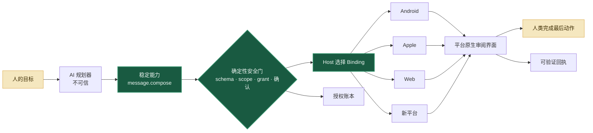

<p align="center">
  
</p>

<h1 align="center">Jidan</h1>

<p align="center">
  <strong>面向 App 与设备的开放式 AI 能力运行时。</strong><br />
  一份意图契约，多种平台 Binding，现实动作的最后一步仍由人决定。
</p>

<p align="center">
  <a href="#-快速开始"></a>
  <a href="profiles/message.compose.tool.json"></a>
  <a href="docs/i18n/README.md"></a>
  <a href="CONTRIBUTING.md"></a>
</p>

<p align="center">
  <a href="README.md">English</a> ·
  <a href="README.zh-CN.md">简体中文</a> ·
  <a href="README.zh-TW.md">繁體中文</a> ·
  <a href="README.ja.md">日本語</a> ·
  <a href="README.es.md">Español</a>
</p>

> [!IMPORTANT]
> Jidan 仍是实验原型，不是完整 Android 发行版、提权工具或可托管重要事务的生产助手。请只连接受控 App、测试设备和可丢弃数据。

## ✨ 为什么做 Jidan

今天的软件仍以 App 围墙为中心：一个简单目标要穿过页面、广告、权限和互不兼容的平台接口。Jidan 尝试把软件的最小单位变成一份**能力契约**——AI 可以提出调用建议，但只有确定性的 Host 才能授权和执行。

```text
人的目标 → 语义动作 → 能力契约 → 策略门
         → 已选择的适配器 → 原生交接 → 人类提交 → 可验证回执
```

长期目标不是再造一个“超级 App”，而是形成一层薄而开放的兼容腰部，让 Android、Apple、Web、HarmonyOS、Windows 以及未来平台实现同一套稳定意图语义。

## 🔌 一份契约，多端实现

[`message.compose`](profiles/message.compose.tool.json) 是第一份 Jidan Capability Layer（JCL）Profile。JCL 是 MCP Tool 的能力剖面，不是新编程语言，也不另造传输协议。

```python
from jidan.message_compose import planned_message_compose_binding
from jidan.registry import CapabilityRegistry

registry = CapabilityRegistry()
planned_message_compose_binding("ios").register(registry)  # 由 Host 配置平台

# 上层只认识能力，不需要知道平台。
result = registry.invoke("message.compose", {"content": "下午三点见。"})
```

| 稳定契约 | 可替换 Binding | 当前证据 |
|---|---|---|
| `message.compose` | Android Intent | 数据计划；已有经验证的微信原生交接 |
| `message.compose` | Apple Shortcut / Share Sheet | 数据计划 |
| `message.compose` | Web 可编辑草稿 | 数据计划 |
| `message.compose` | 社区 Adapter | 本地注册，不需要中央发布白名单 |

所有结果都必须如实表达现实状态：

```json
{
  "state": "handoff_planned",
  "delivery": {
    "attempted": false,
    "sent": false,
    "verified": false
  },
  "nextAction": "user_review_and_send"
}
```

`handoff_planned` 绝不能冒充“界面已经拉起”。只有真实验证过 Android Picker 才能报告 `handoff_opened`；即便如此，发送仍是 `false`，因为 Jidan 不选择联系人，也不点击发送。

## 🧭 架构



## ✅ 今天已经能做什么

| 层级 | 状态 | 证据 |
|---|---:|---|
| 能力注册与 Schema 校验 | ✅ | 无第三方依赖的 Python 原型 |
| 任务图、限权 Grant、确认门 | ✅ | 确定性预检与执行 |
| 持久重放拦截 | ✅ | SQLite 授权账本 |
| 哈希链执行回执 | ✅ | Runtime Receipt Log |
| Android 17 AppFunctions | ✅ | 受控 Provider 与真机 Harness |
| 语义表面发现 | ✅ | AppFunctions → RemoteInput → Shortcut → 公开分享 |
| 微信原生交接验证 | ✅ | 验证准确 Picker；不选人、不发送 |
| 跨端 `message.compose` Profile | 🧪 | Android / iOS / Web 计划；Android 已验证 Binding |
| 生产级移动 Agent OS | 🗺️ | 尚未宣称完成 |

## 🛡️ 把安全写进结构

- **AI 规划器不是安全边界：**模型输出始终按不可信数据验证。
- **开放发布不等于盲目执行：**任何人都能实现 Adapter，但本机仍掌握安装信任、策略、隔离与撤销。
- **收件人提示不是授权：**`message.compose.recipient` 永远不会传给平台 Binding。
- **Adapter 无权宣布成功：**发送状态由 Host 生成，不照抄第三方返回值。
- **模糊结果不会被重试成成功：**未知就是未知，并保守写入回执。
- **用户拥有最后一步：**发送、支付、删除和安全设置必须具有明确提交边界。

连接真实设备前请阅读 [SECURITY.md](SECURITY.md)。

## 🚀 快速开始

使用 Python 3.11+ 运行完整的无依赖原型测试与跨端演示：

```bash
cd prototype
python -m unittest discover -s tests -p "test_*.py"
python message_compose_demo.py
python appfunctions_smoke.py
```

检查全部 Android 语言包：

```bash
python prototype/tools/check_locales.py
```

使用 JDK 17+ 和 Android SDK 37 构建受控 Reference App：

```bash
cd reference-app
./gradlew :app:assembleDebug
```

Windows 请用 `gradlew.bat`。PowerShell 5.1 的 Unicode 注意事项见[原型说明](prototype/README.md#windows-unicode-arguments)。

## 🗂️ 仓库地图

```text
profiles/       与 MCP 兼容的 JCL 能力 Profile
prototype/      能力内核、Adapter、策略、授权、回执与演示
reference-app/  受控 Android 17 AppFunctions Provider
docs/           架构、调研、路线图与国际化说明
```

APK、模拟器镜像、原始设备日志、截图、回执和 SQLite 账本不会提交到 Git。

## 🌍 多语言，但不分裂协议

- 任意 Unicode 正文可以穿过 JSON、任务图、ADB、存储、回读和 UI。
- Android Reference UI 已提供 **23 个种子 Locale**，包括 RTL 阿拉伯语。
- `memo: <正文>` 是语言无关的确定性入口。
- 能力 ID、Schema 字段、Grant、哈希和回执值始终保持稳定 ASCII。
- 新增 UI 翻译和受审查的语言 Adapter，不需要 Fork 协议。

种子翻译只是开源起点，不冒充母语人工审校。欢迎在[语言与国际化指南](docs/i18n/README.md)里认领一种语言。

## 🤝 一起建设

我们尤其欢迎：新平台 `message.compose` Binding、能抓住“假成功”的一致性测试、23 个 Locale 的母语审校、受约束的语言 Adapter，以及基于受控设备的可复现实验。

从 [CONTRIBUTING.md](CONTRIBUTING.md) 和 [90 天路线图](docs/04-90-day-execution-roadmap-zh.md)开始。

## 许可证

Apache License 2.0，详见 [LICENSE](LICENSE) 与 [NOTICE](NOTICE)。
