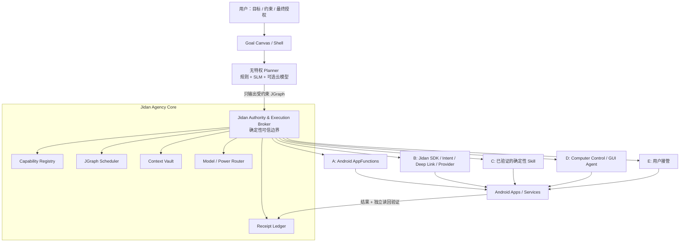

# Jidan v0 架构提案

## 产品定义

> **Jidan 是目标原生、能力驱动、用户持有最终权力的 Agent 操作系统。**

它不先替换 Linux、驱动、Binder、ART 和 APK 生态，而是先替换 Android 上层最重要的系统原语：

| 传统移动 OS | Jidan |
|---|---|
| App 图标是入口 | 用户目标是入口 |
| Activity/窗口是工作单位 | 持久任务图是工作单位 |
| App 是功能单位 | Capability 是功能单位，App 是能力提供者与信任域 |
| 长期权限授予 App | 权力按任务、资源、时间、次数临时委托 |
| 模型直接调工具 | 模型只提出计划，确定性 Broker 执行 |
| 成功等于某个 UI 出现 | 成功必须有独立验证证据和回执 |
| 失败就报错 | 可逆步骤补偿，用户可暂停、撤销或接管 |

一句话：**目标即入口，能力即应用，授权即边界，回执即信任。**

## 为什么不是先做 ROM

iOS/Android 当年不是靠“新内核”单点击败塞班，而是同时重做了触控交互、应用契约、SDK、分发和安全模型。Jidan 也必须先证明新交互和新软件单位；首年复用 Android 17/AOSP 的硬件与 App 兼容层，验证后再下沉控制权。

## 总体架构



### 信任边界

模型、网页、邮件、聊天、AppFunctions KDoc 和屏幕文字全部是不可信输入。Planner 不持有 Binder、InputManager、文件、网络或跨 App 权限；它只能生成 JGraph。Privileged Broker 依据系统政策、用户授权和 Provider 身份校验图，再签发能力令牌和执行。

这条边界不可妥协：**模型不是内核。**

## JGraph：超轻量任务执行语言

JGraph 不是对话历史，而是可恢复、可检查、可序列化的系统任务。

### 节点类型

`Read / Transform / Branch / Call / Confirm / Wait / Verify / Compensate / Emit / Handoff`

每个节点必须声明：

- 输入/输出类型和数据来源；
- effect：`read / write / send / delete / pay / security_change`；
- 所需 authority 与资源范围；
- 超时、重试上限和幂等键；
- 网络目的地、费用、延迟和能耗预算；
- 前置与后置条件；
- 可逆性、补偿节点和撤销期限；
- 结果验证方式与保证等级。

状态机：

```text
DRAFT → SIMULATED → AUTHORIZED → RUNNING → WAITING
                                      ├→ COMMITTED
                                      ├→ COMPENSATED
                                      └→ FAILED
```

执行规则：

1. 默认 DAG；循环必须有显式次数上限。
2. 先模拟完整图，再请求授权；确认前不得产生部分副作用。
3. 不可逆动作尽量放在最终提交边界。
4. 跨 App 不虚构 ACID 事务，采用 Saga 补偿。
5. 每个节点持久化检查点；杀进程、重启或网络中断后可恢复。
6. Provider/版本/schema 改变时重新校验计划。
7. 低置信度不无限 ReAct，转为询问或用户接管。

## Jidan Capability Contract（JCC）

AppFunctions 是首版发现和调用入口；JCC 在其之上补足安全、事务和资源语义：

```json
{
  "id": "calendar.event.create",
  "version": "1.0.0",
  "provider": {
    "package": "com.example.calendar",
    "certificate_sha256": "..."
  },
  "input_schema": {},
  "output_schema": {},
  "effects": ["write"],
  "data_classes": ["calendar.event"],
  "network_destinations": [],
  "risk": "reversible_write",
  "idempotency": "required",
  "reversible": true,
  "compensation": "calendar.event.delete",
  "verify": "calendar.event.get",
  "budgets": {"latency_ms": 1500, "energy": "low"}
}
```

Provider 的自然语言描述只用于检索，不可自报低风险或改变系统政策。风险由签名身份、已认证 schema、实际 effect 和系统策略共同决定。

调用生命周期：

```text
Discover → Normalize → Simulate → Plan → Authorize
         → Issue Token → Execute → Verify → Receipt → Compensate
```

## 授权模型

权力链为：

```text
Human → Task → Agent → Capability → Resource
```

能力令牌只能缩小，不能扩权，至少绑定：用户、任务 ID、Provider、函数、资源/字段、调用次数、到期时间、网络目的地、金额/联系人范围、前后台条件和策略版本。

确认分级：

| 行为 | 默认策略 |
|---|---|
| 非敏感纯读取 | 可按用户规则自动执行 |
| 可撤销本地写入 | 计划级一次确认 |
| 敏感读取、外部通信 | 调用前确认 |
| 发送、删除、支付、安装、账户/安全设置 | 最终提交点确认，必要时生物认证 |
| OTP、密码、验证码、安全页 | GUI Agent 禁止代填或绕过 |

## 回执与验证

每个节点产生机器可读和用户可读回执：任务/计划哈希、Provider 与证书、函数版本、脱敏参数、令牌范围、策略版本、起止时间、返回值、写入资源 ID、独立验证结果、模型/适配器版本、补偿函数和撤销期限。

回执由 Broker 使用硬件支持密钥签名并形成哈希链。保证等级：

- A：类型化 Provider 结果 + 独立读回验证；
- B：系统 API 结果 + 读回验证；
- C：GUI 语义树或截图验证。

Jidan v0 原型已实现 JCC schema 子集校验、HMAC 计划绑定授权、执行前确认、授权前零副作用和哈希链一致性校验。当前哈希链尚不能抵抗有权限重写整份日志的攻击者，nonce 也仅在单进程内防重放；真机写入前必须补上 Android Keystore/StrongBox 认证回执、SQLite/Proto 原子执行账本与 Provider 证书 allowlist。

执行器采用保守失败语义：写入或外部调用一旦进入 Provider，随后发生超时、断线或输出契约失败，就标记为 `outcome_unknown` / `committed_unverified` 并禁止自动重试；只有能证明尚未开始副作用的错误才是普通 `failed`。

## 兼容路径的严格优先级

1. **AppFunctions**：类型化、低延迟、可取消、最可靠。
2. **Jidan SDK / Intent / Deep Link / ContentProvider / 公共 AIDL**。
3. **已验证的确定性 Skill**：固定 App 版本和状态前置条件，可随时失效回退。
4. **Computer Control / GUI Agent**：隔离虚拟显示、观察限额、敏感边界停机。
5. **用户接管**。

GUI Agent 是兼容 BIOS，不是未来 ABI。真实闭源 App 基准当前最强成功率仍只有 62%，且 GUI 无法可靠表达幂等、事务、撤销和隐藏状态。[AndroidDaily](https://arxiv.org/abs/2605.27761)

在 stock Android 上，Accessibility 只能用于用户主动、前台可见、符合商店政策的研究/辅助模式；完整后台 GUI 控制只在 Jidan AOSP 镜像、OEM 预装或合规企业设备环境中提供。

## 端侧调度与功耗

不让生成模型全天候思考：

- 规则处理已知路由、风险和模板；
- embedding 检索 Top-K 能力；
- 0.3B–1B INT4 SLM 只做意图/槽位/排序/JGraph 生成；
- 大本地模型按需加载；复杂推理按用户策略切云端；
- GUI 视觉模型只在前台兼容会话加载；
- 一次只驻留一个生成模型，事件驱动唤醒。

初始工程 SLO：常驻 Core <80 MB；简单目标一次规划、输出 <256 token；GUI 每任务最多 12 次观察/20 个动作；低电量/高温停止非必要推理；日均增量耗电 <2%。这些是验收目标，不是未经实测的宣传数字。

## Android/AOSP 落点

### 可安装 Shell

验证 Goal Canvas、JGraph/JCC、用户确认、回执和合作 App SDK。它不能假装获得跨 App AppFunctions 或 Computer Control 特权。

### AOSP 17 / Cuttlefish

- Jidan 预装为 privileged/default assistant；
- 跨包 AppFunctions 适配器；
- `jidan_core` 独立服务，通过 Stable AIDL 暴露最小接口；
- Planner 在无特权进程或 AVF/pVM 中运行；
- Settings/SystemUI 提供能力开关、任务授权和回执；
- Broker 使用独立 SELinux domain，default-deny；
- 可更新部分逐步封装为 APEX；
- 保持 APK、ART、Binder、HAL、GKI 不变。

### OEM 参考设备

在真实 BSP 上验证 NPU delegate、热/电、OTA 回滚、CTS/VTS 和一台参考硬件。12 个月现实终点是 Developer Preview + SDK + 参考设备，不是成熟量产生态。

## 首个黄金流程

> “把这张群聊截图里的周三会议安排好：加入日历，提前 45 分钟提醒，整理一个议程，并生成给参会人的确认消息。”

它同时验证 OCR/槽位、跨 App 组合、可撤销写入、草稿式外发、一次计划确认、GUI 兼容、杀进程恢复、回执与撤销；又避开首版不该触碰的支付、自动发送、删除和系统安全设置。

北极星指标：**Verified Goal Completion Rate——用户接受的目标中，完成且被独立验证的比例。** 原生能力和 GUI 路径必须分开统计，目标是 GUI 占比逐月下降。
