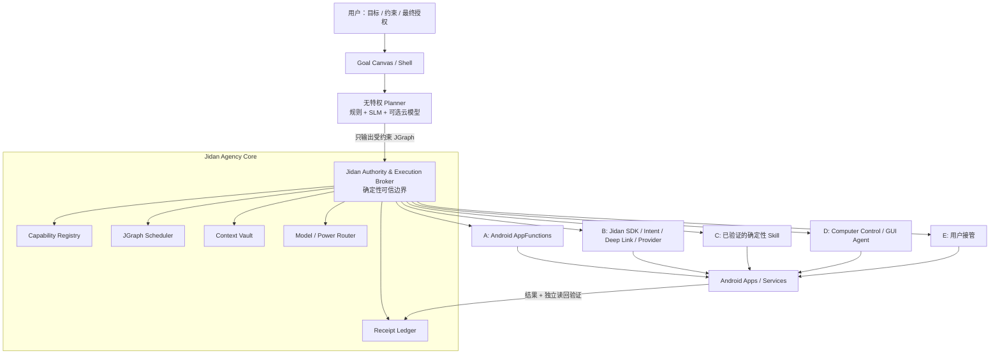

# Jidan v0 架构提案

## 产品定义

> **Jidan 是目标原生、能力驱动、用户持有最终权力的开放能力层与确定性执行 Runtime。**

它不先替换 Linux、驱动、Binder、ART 和 APK 生态，而是先替换 Android 上层最重要的系统原语：

| 传统移动 OS | Jidan |
|---|---|
| App 图标是入口 | 用户目标是入口 |
| Activity/窗口是工作单位 | 持久任务图是工作单位 |
| App 是功能单位 | Capability 是功能单位，App 是能力提供者与信任域 |
| 长期权限授予 App | 权力按任务、资源、时间、次数临时委托 |
| 模型直接调工具 | 模型只提出计划，确定性 Broker 执行 |
| 成功等于某个 UI 出现 | 成功必须有独立验证证据和回执 |
| 失败就报错 | 可逆步骤补偿，用户可暂停、撤销或接管 |

它可以逐步成为 Agent OS 的上层原语，但首要任务不是自称新的操作系统，而是先证明跨 Android、Apple、Web 与未来平台的能力契约、授权边界和真实结果语义能够互操作。

一句话：**目标即入口，能力即应用，授权即边界，回执即信任。**

## 为什么不是先做 ROM

iOS/Android 当年不是靠“新内核”单点击败塞班，而是同时重做了触控交互、应用契约、SDK、分发和安全模型。Jidan 也必须先证明新交互和新软件单位；首年复用 Android 17/AOSP 的硬件与 App 兼容层，验证后再下沉控制权。

技术史给出的不是“所有东西最终降到同一种语言”，而是“选择一条窄而稳定的公共边界，把平台差异留在边缘”。因此 Jidan 共享 JCL Profile、结果语义与一致性夹具，不强制 Android、Apple、Web 共用 Runtime、UI、源代码或 C ABI。完整事实校准与路线护栏见[《从 C/UNIX、Java、Web 到 AI》](06-history-lessons-and-route-guardrails-zh.md)。

## 总体架构



### 信任边界

模型、网页、邮件、聊天、AppFunctions KDoc 和屏幕文字全部是不可信输入。Planner 不持有 Binder、InputManager、文件、网络或跨 App 权限；它只能生成 JGraph。Privileged Broker 依据系统政策、用户授权和 Provider 身份校验图，再签发能力令牌和执行。

这条边界不可妥协：**模型不是内核。**

## JGraph：Host 内部的可恢复任务表示

JGraph 不是新的生态编程语言、传输协议或开发者必学 DSL。它是 Jidan Host 内部可恢复、可检查、可序列化的任务表示；其他 Host 可以使用自己的计划结构，只要对外遵守同一能力契约和结果语义。

### 节点类型

`Read / Transform / Branch / Call / Confirm / Wait / Verify / Compensate / Emit / Handoff`

每个节点必须声明：

- 输入/输出类型和数据来源；
- effect：`read / write / send / delete / pay / security_change`；
- 所需 authority 与资源范围；
- 超时、重试上限和幂等键；
- 网络目的地、费用、延迟和能耗预算；
- 前置与后置条件；
- 可逆性、补偿节点和撤销期限；
- 结果验证方式与保证等级。

状态机：

```text
DRAFT → SIMULATED → AUTHORIZED → RUNNING → WAITING
                                      ├→ COMMITTED
                                      ├→ COMPENSATED
                                      └→ FAILED
```

执行规则：

1. 默认 DAG；循环必须有显式次数上限。
2. 先模拟完整图，再请求授权；确认前不得产生部分副作用。
3. 不可逆动作尽量放在最终提交边界。
4. 跨 App 不虚构 ACID 事务，采用 Saga 补偿。
5. 每个节点持久化检查点；杀进程、重启或网络中断后可恢复。
6. Provider/版本/schema 改变时重新校验计划。
7. 低置信度不无限 ReAct，转为询问或用户接管。

## 输入 Frontend：语言实验不是机器底层

语言输入位于 JCL 信任边界之外。Pinyin Frontend 0.1 曾验证“受审查别名只能产生无权限 Proposal”这条边界；该实验已于 **2026-08-02 冻结归档**。现有代码、Profile 与测试暂时保留用于兼容和复现，但不再进入活跃路线，不接受新语法、模糊解析或别名扩张。

```text
chuàng-jiàn.cǎo-gǎo + 原样正文
        ↓ NFC / 显式边界 / 数字调 / 唯一别名
InvocationProposal(message.compose, {content: 原样正文})
        ↓ 仍按不可信数据处理
Schema → Policy → Grant → Confirm → Runtime → Binding
```

冻结版本仍遵守原边界：它不是 JCL 源码、字节码、公共协议或机器底层，不能调用 Registry、选择平台、发放 Grant 或执行 Adapter；姓名、正文、URL、金额、账号和凭据也不转写。完整冻结设计与依据见[《JCL 拼音编译前端 0.1》](05-jcl-pinyin-frontend-zh.md)。后续输入研究应围绕既有能力的可验证调用，而不是继续发明语言表面。

## Jidan Capability Layer（JCL）

JCL 不另造语法和传输层。当前公开 Profile 直接复用 MCP Tool 与 JSON Schema，并把 Jidan 的最小风险语义放在命名空间 `_meta` 中。JCL 的稳定身份是 capability、Schema 与可观察结果，不绑定某一版 MCP handshake、session 或 transport；MCP 演进时由 Binding/Profile 版本吸收差异：

```json
{
  "name": "message.compose",
  "description": "Prepare an editable message or user-controlled handoff.",
  "inputSchema": {},
  "outputSchema": {},
  "annotations": {
    "readOnlyHint": false,
    "destructiveHint": false,
    "idempotentHint": false,
    "openWorldHint": true
  },
  "_meta": {
    "dev.jidan/capability-v0.1": {
      "riskLevel": "WRITE",
      "executionMode": "HANDOFF",
      "reversible": false
    }
  }
}
```

`profiles/message.compose.tool.json` 是首份可执行 Profile。同一个 `message.compose` 能映射到 Android Intent、Apple Shortcut / Share Sheet、Web 草稿或社区 Binding；调用方只提交能力与参数，平台选择属于 Host 配置。

[`game.ninelights.start` 与 `game.ninelights.press`](07-universal-game-spike-zh.md) 是一个更小的离线一致性尖峰：Python CLI 通过完整 TaskPlan、Grant、Runtime 与 Receipt 执行，Web 则使用独立 JavaScript Host 重放同一组 conformance vectors。它验证共享语义，不宣称共享 Runtime 或移动端覆盖。

共享语义不等于共享实现、权限或保证等级：Web Binding 仍受浏览器沙箱限制，Apple/Android 各自保留原生权限与生命周期，C ABI 只可能存在于某个本地 Adapter 内部。跨 Host 的边界如下：

| 可跨 Host 共享 | 必须留在 Host / Binding 本地 |
|---|---|
| Capability ID、Profile 版本与 JSON Schema | 自然语言、语音、UI 与已冻结的拼音兼容 Frontend |
| 风险、结果与回执语义 | JGraph、调度、缓存和持久状态实现 |
| Conformance fixtures 与最低安全不变量 | Kotlin / Swift / JavaScript / C/C++ 代码 |
| 关键精确状态示例：Profile 的 `handoff_planned / handoff_opened`、Task 的 `completed / unknown`、Receipt 的 `succeeded / committed_unverified / outcome_unknown` | OS 权限、Provider 身份、原生 UI 与生命周期 |

公开 Profile 保持薄。Provider 证书、真实 scope、幂等记录、网络目的地、金额限制、补偿、预算与持久任务状态由资源责任方和 Host 安全账本保存，不膨胀成每个平台都必须复制的公共 DSL。具体 Binding 只能收紧风险、scope 和确认要求，不能因为 Provider 自报低风险而放宽系统策略。

Profile 的状态必须区分现实：

- `handoff_planned`：仅生成调用计划，不声称界面已拉起；
- `handoff_opened`：Binding 已验证其声明的原生或可编辑审阅界面；
- 两者都保持 `delivery.attempted=false`、`sent=false`，最终发送由用户完成。

开放实现不等于盲目执行：发布 Adapter 无需中央白名单，但安装信任、隔离、策略、撤销和一致性测试由每台终端掌握。

调用生命周期：

```text
Discover → Normalize → Simulate → Plan → Authorize
         → Issue Token → Execute → Verify → Receipt → Compensate
```

## 授权模型

权力链为：

```text
Human → Task → Agent → Capability → Resource
```

能力令牌只能缩小，不能扩权，至少绑定：用户、任务 ID、Provider、函数、资源/字段、调用次数、到期时间、网络目的地、金额/联系人范围、前后台条件和策略版本。

确认分级：

| 行为 | 默认策略 |
|---|---|
| 非敏感纯读取 | 可按用户规则自动执行 |
| 可撤销本地写入 | 计划级一次确认 |
| 敏感读取、外部通信 | 调用前确认 |
| 发送、删除、支付、安装、账户/安全设置 | 最终提交点确认，必要时生物认证 |
| OTP、密码、验证码、安全页 | GUI Agent 禁止代填或绕过 |

## 回执与验证

每个节点产生机器可读和用户可读回执：任务/计划哈希、Provider 与证书、函数版本、脱敏参数、令牌范围、策略版本、起止时间、返回值、写入资源 ID、独立验证结果、模型/适配器版本、补偿函数和撤销期限。

回执由 Broker 使用硬件支持密钥签名并形成哈希链。保证等级：

- A：类型化 Provider 结果 + 独立读回验证；
- B：系统 API 结果 + 读回验证；
- C：GUI 语义树或截图验证。

Jidan v0 原型已实现 Schema 子集校验、HMAC 计划绑定授权、执行前确认、授权前零副作用、SQLite 持久 nonce 消费和哈希链一致性校验。当前哈希链尚不能抵抗有权限重写整份日志的攻击者，SQLite 文件也不能抵抗被整体回滚到旧的有效版本；系统版仍需 Android Keystore/StrongBox 认证锚点、受保护的持久任务状态机与 Provider 身份校验。

执行器采用保守失败语义：写入或外部调用一旦进入 Provider，随后发生超时、断线或输出契约失败，就标记为 `outcome_unknown` / `committed_unverified` 并禁止自动重试；只有能证明尚未开始副作用的错误才是普通 `failed`。

## 兼容路径的严格优先级

1. **AppFunctions**：类型化、低延迟、可取消、最可靠。
2. **Jidan SDK / Intent / Deep Link / ContentProvider / 公共 AIDL**。
3. **已验证的确定性 Skill**：固定 App 版本和状态前置条件，可随时失效回退。
4. **Computer Control / GUI Agent**：隔离虚拟显示、观察限额、敏感边界停机。
5. **用户接管**。

GUI Agent 是兼容 BIOS，不是未来 ABI。真实闭源 App 基准当前最强成功率仍只有 62%，且 GUI 无法可靠表达幂等、事务、撤销和隐藏状态。[AndroidDaily](https://arxiv.org/abs/2605.27761)

在 stock Android 上，Accessibility 只能用于用户主动、前台可见、符合商店政策的研究/辅助模式；完整后台 GUI 控制只在 Jidan AOSP 镜像、OEM 预装或合规企业设备环境中提供。

## 端侧调度与功耗

不让生成模型全天候思考：

- 规则处理已知路由、风险和模板；
- embedding 检索 Top-K 能力；
- 0.3B–1B INT4 SLM 只做意图/槽位/排序/JGraph 生成；
- 大本地模型按需加载；复杂推理按用户策略切云端；
- GUI 视觉模型只在前台兼容会话加载；
- 一次只驻留一个生成模型，事件驱动唤醒。

初始工程 SLO：常驻 Core <80 MB；简单目标一次规划、输出 <256 token；GUI 每任务最多 12 次观察/20 个动作；低电量/高温停止非必要推理；日均增量耗电 <2%。这些是验收目标，不是未经实测的宣传数字。

## Android/AOSP 落点

### 可安装 Shell

验证 Goal Canvas、JCL、内部 JGraph、用户确认、回执和合作 App SDK。它不能假装获得跨 App AppFunctions 或 Computer Control 特权。

### AOSP 17 / Cuttlefish

- Jidan 预装为 privileged/default assistant；
- 跨包 AppFunctions 适配器；
- `jidan_core` 独立服务，通过 Stable AIDL 暴露最小接口；
- Planner 在无特权进程或 AVF/pVM 中运行；
- Settings/SystemUI 提供能力开关、任务授权和回执；
- Broker 使用独立 SELinux domain，default-deny；
- 可更新部分逐步封装为 APEX；
- 保持 APK、ART、Binder、HAL、GKI 不变。

### OEM 参考设备

在真实 BSP 上验证 NPU delegate、热/电、OTA 回滚、CTS/VTS 和一台参考硬件。12 个月现实终点是 Developer Preview + SDK + 参考设备，不是成熟量产生态。

## 首个黄金流程

> “把这张群聊截图里的周三会议安排好：加入日历，提前 45 分钟提醒，整理一个议程，并生成给参会人的确认消息。”

它同时验证 OCR/槽位、跨 App 组合、可撤销写入、草稿式外发、一次计划确认、GUI 兼容、杀进程恢复、回执与撤销；又避开首版不该触碰的支付、自动发送、删除和系统安全设置。

北极星指标：**Verified Goal Completion Rate——用户接受的目标中，完成且被独立验证的比例。** 原生能力和 GUI 路径必须分开统计，目标是 GUI 占比逐月下降。
