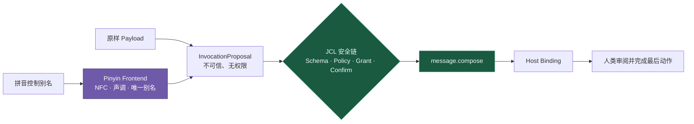

# JCL 拼音编译前端 0.1

## 一句话定位

> **拼音可以成为 JCL Frontend 的人类友好输入拼写，但不能成为 JCL 源码、字节码、权限标识、机器底层或唯一机器语言。**

JCL 的跨端公共表示仍然是稳定的 capability ID、JSON Schema 与结果语义；JCL 0.1 的首个公开序列化采用与 MCP 兼容的 Tool Profile。拼音前端只是位于信任边界之外的可选编译器：它把经过审查的拼音控制别名转换成一份尚未授权的 JCL 调用提案。

```text
拼音控制别名 + 原样参数
        ↓
Pinyin Frontend（无权限，只编译）
        ↓
InvocationProposal（仍是不可信数据）
        ↓
JSON Schema → Policy → Grant → Confirmation
        ↓
稳定 capability ID → Host Binding → Receipt
```

这既吸收中文和语音输入资产，也避免另造一门所有平台都必须实现的语言。



## 0.1 已实现什么

机器可读 Profile：[`profiles/frontends/zh-Latn-pinyin.frontend.json`](../profiles/frontends/zh-Latn-pinyin.frontend.json)

首个经过审查的映射：

```text
chuàng-jiàn.cǎo-gǎo
        ↓ NFC + 显式边界 + 数字调归一化
chuang4-jian4.cao3-gao3
        ↓ 版本化 alias 表
message.compose
```

等价输入包括：

- `chuàng-jiàn.cǎo-gǎo`：带调号的技术别名；
- `chuang4-jian4.cao3-gao3`：数字调查找键；
- `chuang-jian.cao-gao`：仅当去调后全表只有一个别名时接受。

编译结果不是执行结果：

```json
{
  "status": "resolved",
  "proposal": {
    "capability": "message.compose",
    "arguments": {
      "content": "下午三点见。"
    }
  },
  "evidence": {
    "frontendProfile": "dev.jidan/zh-Latn-pinyin-v0.1",
    "normalizedAlias": "chuang4-jian4.cao3-gao3",
    "aliasSetSha256": "..."
  }
}
```

这份 Proposal 还必须通过原有 Schema、策略、Grant、确认与回执链。前端自身不能调用 Registry、选择平台、签发授权或执行 Adapter。

## 控制面与数据面必须分离

拼音只解释**控制别名**。正文、姓名、URL、金额、账号、验证码和密码都是数据，不得被静默转写或猜测。

例如下面的正文逐字符保留：

```text
老板：下午三点见 🚀 fa xiaoxi
```

`fa-xiao-xi` 也不会被默认映射到 `message.compose`。在自然语言里“发消息”暗示发送，而当前能力只准备草稿或打开人工交接；把两者偷偷等同会扩大权限。

## 规范化规则

0.1 Profile 固定以下规则：

1. 输入先做 Unicode NFC 与大小写折叠；NFC 让预组合声调字符和“字母 + 组合音标”得到相同结果。[Unicode UAX #15](https://www.unicode.org/reports/tr15/)
2. 词边界使用 `.`，音节边界使用 `-`；ASCII 空格可作为词边界。运行时不从连续字母猜分词。
3. 查找键只含 ASCII 小写字母、`v`、数字调 `1–5`、`.` 与 `-`；`ü` 在查找键中写作 `v`。
4. 一条技术输入必须为每个音节都提供调值（调号或数字 `1–5`），或整条完全不提供；同一音节不能混用调号与数字。
5. 调号必须落在汉语拼音的主要元音上，每个音节只能有一个调号；输入音节还必须属于内置的普通话拼音音节表。
6. 无声调输入只有在全表恰好命中一个经过审查的别名时才通过；即便多个同音别名指向同一 capability，也必须拒绝。
7. 未知、混合脚本、零宽字符、双向控制符、全角伪装、模糊拼写和越权别名全部拒绝。

拼音语言标签使用 IANA 已登记的 [`zh-Latn-pinyin`](https://www.iana.org/assignments/language-subtag-registry/language-subtag-registry)。Profile 的人类显示形式 `chuàngjiàn cǎogǎo` 参考现行 [GB/T 16159-2012《汉语拼音正词法基本规则》](https://openstd.samr.gov.cn/bzgk/std/newGbInfo?hcno=5645BD8DB9D8D73053AD3A2397E15E74)；`.`、逐音节 `-`、数字调与 `v` 都只是 JCL Frontend 的稳定查找语法，不冒充国家正词法。

## 为什么必须显式别名表

[ISO 7098:2015](https://www.iso.org/standard/61420.html) 定义的是汉语罗马化。结合多音字、同音词、分词和语境会产生多个合法候选这一事实，Jidan 得出的设计结论是：拼音即使带声调也不能充当可逆编码或权限标识。

因此运行时只读取作者确认并固化的 alias manifest：

- Han → Pinyin 自动转写最多作为编辑器建议；
- 作者必须确认含义、声调、边界和目标 capability；
- 映射集合按规范化键计算 SHA-256；
- 编译证据记录 Frontend、规范化别名、词表哈希和 Unicode 版本；
- 词表升级后不能重新解释已经确认过的计划。

## 标识符安全

Jidan 0.1 采用比通用 Unicode 标识符更窄的允许集：输入只能由拉丁拼音字符、声调、数字和规定的 ASCII 分隔符组成。混合脚本与不可见字符直接失败；不会把 confusable skeleton 当成真正的 capability ID。

这一边界遵循 [Unicode UAX #31 标识符建议](https://www.unicode.org/reports/tr31/)与 [Unicode UTS #39 安全机制](https://www.unicode.org/reports/tr39/)的原则：用于授权的标识符必须明确限制字符集合并防止视觉混淆。最终授权、签名、计划哈希和回执仍只绑定 `message.compose` 这样的稳定 ASCII capability ID。

## Profile 与实现

```text
profiles/
  message.compose.tool.json                  # JCL 能力契约，不因拼音改变
  frontends/zh-Latn-pinyin.frontend.json     # 可选编译前端
  schemas/jcl.input-frontend-v0.1.schema.json

prototype/jidan/pinyin_frontend.py           # 确定性、无网络编译器
prototype/pinyin_frontend_demo.py             # 默认止于确认门；可显式模拟后续 Runtime 链
prototype/tests/test_pinyin_frontend.py       # 归一化、冲突和权限边界测试
```

JSON Schema 负责可表达的结构约束；alias 是否落在 allowlist、规范化后是否冲突、完整审阅记录哈希是否匹配，仍必须由语义 Loader 再校验。

运行演示：

```bash
cd prototype
python pinyin_frontend_demo.py
```

默认输出停在 `awaiting_confirmation`。`--simulate-approval` 只用于本地演示后续 Grant、Runtime 与回执阶段，输出会明确标记为模拟批准，不能当作真实用户确认。

## 扩展新别名

贡献一个新拼音别名时必须同时提供：

1. 带完整声调和显式音节边界的 canonical key；
2. 人类显示形式与准确中文含义；
3. 已存在的稳定 capability ID；
4. 去调冲突、未知输入、混合脚本和正文原样保留测试；
5. 更新后的 alias set 哈希；
6. 对风险语义的解释，尤其不能把“准备”“打开”和“已发送”混为一谈。

新增别名不需要中央许可，但 Host 仍可依据本地信任与策略决定是否安装或启用该 Frontend。
