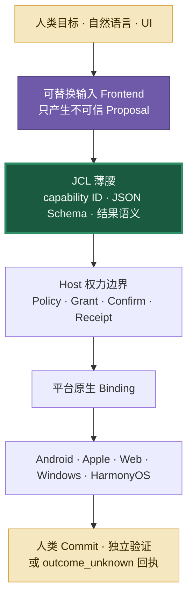

# 从 C/UNIX、Java、Web 到 AI：JCL 的历史镜鉴与路线护栏

> 历史不是一座从 0 和 1 一直向上叠到自然语言的整齐高塔。许多成功的跨平台跃迁，都是重新选择一条更窄、更稳定的边界，同时把无法消失的机器、系统与权力差异留在边缘。

## 总裁决

> **Jidan 统一的是意图语义、风险与可观察结果；不统一人类语言、源代码、UI、Runtime、C ABI 或平台权限。**

JCL 因此不是“下一代 C ABI”，也不是把自然语言一路编译成汇编的新语言工具链。它是一条薄的**语义兼容腰部**：上面可以有自然语言、按钮、语音和其他 Frontend；下面可以有 Android AppFunctions、Intent、Apple App Intents、Web、C/C++ 库或未来平台 Binding。Pinyin Frontend 0.1 是已冻结的输入实验，不再作为活跃路线。



## 先把四层历史说准确

| 历史叙事 | 可以保留的事实 | 不能推出的结论 | Jidan / JCL 的裁决 |
|---|---|---|---|
| C 与 UNIX | C 让大量 UNIX **源代码**可以跨机器复用，并把机器相关部分隔离出来 | 世界存在一个 Windows、Linux、Android、iOS 通用的“C ABI” | 共享语义契约与测试；本机 ABI 只留在 Adapter 内部 |
| 托管语言与 VM | Java 用平台无关字节码与 JVM 把许多移植负担移入 Runtime；GC 自动管理堆内存，不可达对象可被回收 | 面向对象、GC 与 VM 是同一件事；Runtime 消灭了资源、并发和平台差异 | Host Runtime 统一验证、授权、确认和回执，但不强迫所有实现进入同一 VM 或 JGraph DSL |
| Web 与容器 | Web 标准与兼容性规则让内容和应用覆盖更多设备；OCI 规范了镜像、Runtime 与分发接口 | Web “无视”操作系统；容器获得了所有 Host 的原生权限和一致行为 | Web 只是一个受浏览器沙箱约束的 Binding；容器是打包、隔离与部署机制，不是跨 Host 的能力或权限语义 |
| 自然语言与 AI | 生成式 AI 允许用户用自然语言表达任务并生成候选代码，降低部分任务的操作门槛 | Prompt 是确定性程序；模型输出可以直接携带权限或现实结果 | 输入 Frontend 只产生 Proposal；Host 按明确、可审计的规则校验与授权，再执行并记录结果 |

## 第三层：C 的胜利是源代码可移植，不是万能 ABI

Dennis Ritchie 记载，现代 C 的核心在 1973 年前后已经足以重写 UNIX；一次关键的跨机器可移植实验则在 1977 年把 UNIX 移到 Interdata 8/32。移植论文说明大部分源语言表示可以保持相同，也明确列出数据表示、运行约定、中断、内存管理和设备处理仍需机器相关工作。[Ritchie《The Development of the C Language》](https://www.bell-labs.com/usr/dmr/www/chist.pdf)、[Johnson 与 Ritchie《Portability of C Programs and the UNIX System》](https://www.nokia.com/bell-labs/about/dennis-m-ritchie/portpap.html)

“C ABI 统一所有系统”则不成立。即使同为 x86-64，Windows 有自己的调用约定；Android 又按 CPU/指令集维护 `arm64-v8a`、`x86_64` 等多种 ABI，并规定各自的栈、寄存器和二进制格式。[Microsoft x64 ABI](https://learn.microsoft.com/en-us/cpp/build/x64-calling-convention)、[Android NDK ABI](https://developer.android.com/ndk/guides/abis)

对 JCL 的启示不是“所有能力最后降到 C”，而是：

- 公开层稳定的是 `capability ID + schema + observable outcome`；
- Kotlin、Swift、JavaScript、C/C++、AIDL、JNI 和 FFI 都是 Host 或 Adapter 的实现选择；
- 旧 C/C++ 资产可以被 Adapter 包装，不需要重写，也不升级为生态公共语言；
- 平台相关生命周期、权限与 UI 必须显式留在 Binding 中。

## 第四层：Runtime 吸收复杂度，但不能冒充世界已经统一

Java 的关键边界是平台无关字节码：不依赖本机代码和平台专属 API、主要使用标准 Java 平台的应用，可以在提供兼容 Runtime 的硬件与 OS 上运行。不可达对象可以由 GC 回收，但何时回收并无即时保证。这些机制确实降低了开发成本，不过“面向对象”“虚拟机”和“垃圾回收”是不同维度；它们没有消灭文件句柄、网络连接、并发、延迟、后台限制和本机集成。[Oracle《The Java Language Environment》](https://www.oracle.com/java/technologies/architecture-neutral-portable-robust.html)、[Java Language Specification](https://docs.oracle.com/javase/specs/jls/se26/html/jls-1.html)、[HotSpot 与 GC 架构](https://www.oracle.com/java/technologies/whitepaper.html)

Jidan 应继承的是 Runtime 责任，而不是再造 VM：

- Planner 与语言 Frontend 只产生候选计划；
- Broker/Runtime 负责 Schema、scope、Grant、确认、重放防护和回执；
- JGraph 是某个 Host 的内部任务表示，可以演进或被替换；
- 第三方 Host 只需遵守 JCL 的外部语义和一致性夹具，不必使用同一份 Runtime 源码。

## 第五层：Web 统一接口，不统一系统

W3C 的 Web Architecture Recommendation 把 identification、interaction 与 representation 分成正交概念；HTML Working Group 2007 年的设计原则草案又强调兼容既有内容、良好降级、明确行为、避免不必要复杂度和跨设备访问。[W3C《Architecture of the World Wide Web》](https://www.w3.org/TR/webarch/)、[HTML Design Principles](https://www.w3.org/TR/html-design-principles/)

这不等于浏览器消灭了 OS。相机、联系人、后台任务、安全 UI、文件系统和跨 App 权限仍由 Host 决定。容器也没有改变这一事实：OCI 分别规范镜像、Runtime 和分发；Linux 容器共享 Host 内核，Docker Desktop 除原生 Windows 容器外在定制 Linux VM 中运行。[Open Container Initiative](https://opencontainers.org/)、[Docker 容器基础](https://docs.docker.com/get-started/docker-concepts/the-basics/what-is-a-container/)、[Docker 安全 FAQ](https://docs.docker.com/security/faqs/containers/)

Web 给 JCL 的真正配方是：

1. 先解决真实场景，不按理论完美设计整个世界；
2. 保持公开 Profile 薄、行为明确、版本可协商；
3. 新能力可探测，旧实现能诚实降级；
4. 共享契约和一致性测试，不强制共享 UI、Runtime 或源代码；
5. 用户利益优先于作者、实现者与规范洁癖。

## Dropbox 的反例：共享代码不等于共享价值

Dropbox 曾把跨端 C++ 作为移动端共享代码战略，后来复盘发现自定义框架、构建链、调试、人才与平台分歧的成本超过收益，因此主要转向 Swift/Kotlin，同时保留个别确实合适的 C++ 资产。后续 Android 相机上传重写直接利用 WorkManager 等原生约束，可靠性和性能反而改善。[Dropbox 2019 复盘](https://dropbox.tech/mobile/the-not-so-hidden-cost-of-sharing-code-between-ios-and-android)、[Dropbox Android 构建系统复盘](https://dropbox.tech/mobile/modernizing-our-android-build-system-part-i-the-planning)、[Dropbox 2022 Android 重写复盘](https://dropbox.tech/mobile/making-camera-uploads-for-android-faster-and-more-reliable)

这对 Jidan 尤其重要：

> **共享 Profile、测试向量和结果语义；允许每个平台使用最合适的原生实现。**

跨端共创的门槛应该是“一个工作日内能实现一个 Binding 并跑过测试”，而不是“先学一套 Jidan VM、DSL、C++ Core 或统一 UI 框架”。

## 第六层：自然语言是入口，不是可直接执行的程序

黄仁勋确实公开说过自然语言是很好的编程语言，核心意思是生成式 AI 让更多人能向计算机表达任务；截图里的“过去 60 年 / 未来 60 年”长句没有出现在本文核对的 SIGGRAPH 2023 官方 transcript 中，不应据此作为逐字引语传播。[NVIDIA SIGGRAPH 2023 Keynote](https://www.nvidia.com/en-us/on-demand/session/siggraph2023-keynote/)

这是一条产品洞察，不是类型、安全或授权保证。语言模型仍会在不确定时猜测；因此在 Jidan 的安全模型中，结构化输出也只能作为候选数据。[OpenAI《Why Language Models Hallucinate》](https://cdn.openai.com/pdf/d04913be-3f6f-4d2b-b283-ff432ef4aaa5/why-language-models-hallucinate.pdf)

MCP 的演进也支持这条边界：2026-07-28 版移除协议级 session 与初始化握手，把核心改成无状态、自包含请求，并把扩展设为显式协商的可选层；规范仍要求 Host 获得用户同意，并把不可信 Server 的工具 annotation 当成不可信提示。工具风险提示不能替代授权事实。[MCP 2026-07-28 规范](https://modelcontextprotocol.io/specification/2026-07-28)、[版本变更记录](https://modelcontextprotocol.io/specification/2026-07-28/changelog)、[MCP Tool Annotation 的边界](https://blog.modelcontextprotocol.io/posts/2026-03-16-tool-annotations/)

所以 Jidan 的语言路径固定为：

```text
自然语言 / UI / 其他输入 Frontend
        ↓ 不确定、可拒绝、可追问
InvocationProposal
        ↓ 确定性验证
JCL capability + JSON arguments
        ↓ Host 本地权力链
Policy → Grant → Confirmation → Runtime → Receipt
```

Frontend 不得直接调用 Registry、选择 Adapter、扩大 scope、签发 Grant 或声称现实操作已完成。

## 哪些东西跨 Host 共享，哪些必须留在本地

| 跨 Host 的薄公共面 | Host / Binding 本地实现 |
|---|---|
| Capability ID 与 Profile 版本 | 自然语言、语音、UI 与已冻结的拼音兼容解析器 |
| 输入/输出 JSON Schema | JGraph、调度器、缓存与状态存储 |
| 风险分类与结果状态语义 | Kotlin / Swift / JS / C/C++ 代码 |
| Conformance fixtures | OS 权限、Provider 身份与安装信任 |
| 关键精确状态示例：Profile 的 `handoff_planned / handoff_opened`、Task 的 `completed / unknown`、Receipt 的 `succeeded / committed_unverified / outcome_unknown` | 原生审阅 UI、生命周期和降级路径 |
| 最低安全不变量 | 更严格的本机策略、隔离与撤销 |

共享语义不代表共享覆盖范围或保证等级。Web Binding 不能冒充获得移动系统联系人权限；数据计划不能冒充原生界面已经打开；Adapter 自报的低风险不能放宽 Host 策略。

## 路线修正

### P0：先冻结薄腰与一致性，不冻结世界

- 冻结 `message.compose` 的 capability ID、Schema、风险/结果语义和 conformance vectors；
- MCP Tool 是当前公开序列化之一，但 JCL 语义不绑定某一版 MCP handshake、session 或 transport；
- JGraph 保持 Host 内部，不要求独立实现者采用；
- 没有真实场景和至少两个实现证明的字段，不进入公共 Profile。

### P1：发展可替换 Frontend，冻结拼音语法实验

- 编译结果只能是无权限 Proposal；
- 未知、歧义和低置信度必须拒绝或追问；
- 用户内容字段默认不翻译、不转写、不猜测；只有命令槽可按已审查规则规范化为 capability/枚举，除非用户另行明确要求转换内容；
- 用 false resolve、abstention、payload preservation 和零 Adapter 调用衡量质量，不用“听起来聪明”衡量。
- Pinyin Frontend 0.1 自 2026-08-02 起只接受兼容性修复与安全回归，不新增语法、别名或活跃产品入口。

### P2：把 Host 做成真正权力边界

- 先保证 Planner 无法取得 Handler 或签发 Grant；支持的平台优先把 Planner 与 Broker 放进不同进程、UID 或安全主体，其他 Host 使用其最强可用隔离机制；
- Registry handler 只存在于 Broker；
- 未批准、过期、篡改、越 scope、重放都必须在 Adapter 前失败；
- 写入开始后的超时保持 `outcome_unknown`，禁止自动重试成“成功”。

### P3：允许平台原生共创

- Android、Apple、Web 分别使用合适的原生 SDK、权限和审阅界面；
- 发布最小 Adapter Kit 与 conformance runner；
- 目标是一名非核心贡献者一个工作日内完成计划型 Binding；
- 先证明至少一个非 Android 的真实 Binding，再把 AOSP/OEM 投入升级为主路线。

### P4：把人的 Commit 当作系统原语

- `message.compose` 在打开可编辑界面后停止，发送由人完成；
- 仅对私有、事务性、尚未被外部观察且可可靠撤销的本地写入，才允许计划级批准；
- 支付、删除、外发和安全设置必须紧贴真实不可逆点再次确认；
- UI 必须让用户分清 `planned`、`opened`、`sent/committed` 与 `unknown`。

详细天数、Gate 与交付物见[90 天执行路线图](04-90-day-execution-roadmap-zh.md)。

Nine Lights 尖峰把这条历史结论做成了一个很小的可运行检查：Python Host 使用完整 Runtime 与 Receipt，独立 JavaScript Web Host 使用相同 Profile 和 conformance vectors，但不共享 Runtime。它只证明外部语义可以对齐，边界与局限见[《Nine Lights：一次“共享语义，不共享 Runtime”的小游戏尖峰》](07-universal-game-spike-zh.md)。

## 明确不做

- 不把自然语言或拼音定义为 JCL 公共协议、字节码或机器底层；
- 不发明统一所有 Host 的 C ABI、VM、对象模型或编程 DSL；
- 不强制 Android、Apple、Web 共用 UI 或 Runtime 源代码；
- 不用 WebView、浏览器桥或容器宣称获得原生 OS 权限；
- 不让模型、Profile annotation 或 Adapter 自报信息成为授权依据；
- 不先建中央审核栅栏；开放发布与本机信任、隔离、策略分离；
- 不为“完整生态”造功能，先让一个真实目标在两个以上 Host 上通过同一套结果语义。

历史给 JCL 的最终答案不是“再向下编译一层”，而是：

> **让人的表达尽可能开放，让机器契约尽可能窄，让平台实现保持原生，让授权链始终可验证，并让现实结果诚实地区分 committed 与 unknown。**
