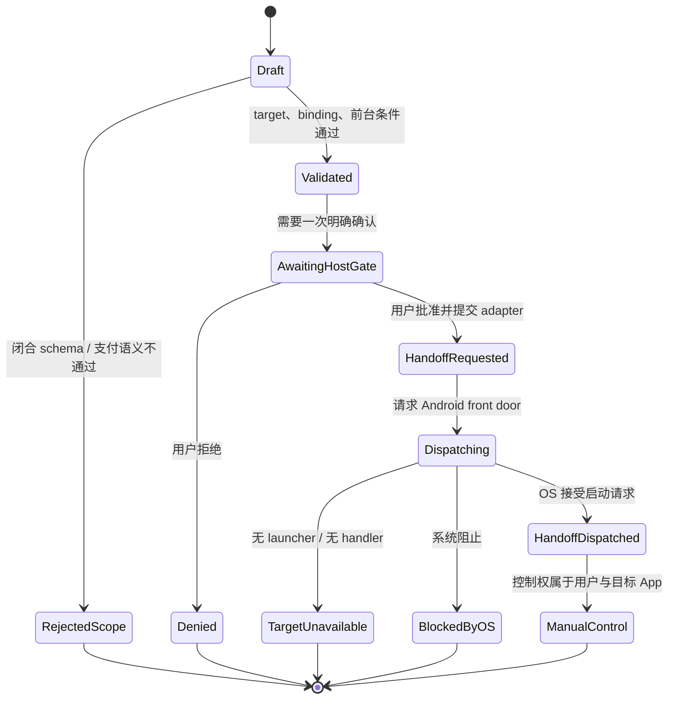

# 支付宝微动作、协议边界与 JCL 修正规则

> 状态：路线约束草案，不是支付宝、Android、AP2 或 MCP 的官方规范。
>
> 核对截止：2026-08-03（Asia/Shanghai）。
> 本文把信息严格分为 **官方事实**、**提交者/社区报告** 与 **Jidan 推断**；三者不能互相冒充。

## 先给结论

Jidan/JCL v1 先只做一件可解释、范围固定、可测试的事：

> 在用户可见且主动触发的 Android 前台界面中，通过受信 adapter 请求系统打开目标 App 的 front door（启动器主页），随后把控制权交还给用户。

v1 明确不做：

- 不拼接、不注册、不宣传任何支付宝私有 Scheme；
- 不直达“扫一扫”、付款页、小程序内部页或未公开 Activity；
- 不接受或传递金额、币种、收款人、商户号、订单、支付凭证、签名支付串；
- 不把“已发出打开请求”写成“已进入指定页面”，更不能写成“已扫码”“已下单”或“支付成功”；
- 不因 adapter 开放注册，就允许 adapter 自称“官方”。开放的是接入机会，不是官方性豁免。

这不是缩小理想，而是先把最薄的一层做成可信地基。支付、扫码和小程序以后可以通过各自的官方 SDK、受验证 HTTPS 链接或官方二维码扩展，但不能偷渡进 v1 的 `app.open.frontdoor`。

## 1. 官方事实：普通第三方真正拥有的边界

### 1.1 Android 允许打开 App 的 front door

**官方事实**

Android `PackageManager.getLaunchIntentForPackage()` 返回用于启动某个包 front-door Activity 的 Intent；API 33 起的 `getLaunchIntentSenderForPackage()`提供同类 front-door 能力，并说明其不受 package visibility 查询限制。找不到可启动 Activity 时，前者返回 `null`，后者发送时可能失败。

来源：[Android PackageManager API](https://developer.android.com/reference/android/content/pm/PackageManager.html)

Android 还说明：普通第三方可以用 `startActivity()` 发起显式或隐式 Activity 请求，并处理 `ActivityNotFoundException`；若只是直接启动，不必为了启动本身先取得完整 package visibility。

来源：[Android package visibility 常见用例](https://developer.android.com/training/package-visibility/use-cases)

Android 10 起限制后台 Activity 拉起，并定义了若干例外条件。

来源：[Android Activity security / background launch restrictions](https://developer.android.com/guide/components/activities/secure-bal)

**Jidan 推断**

- `front door` 只代表目标 App 的启动入口，不代表其中某个业务页面。
- v1 的目标包名属于 adapter 的已审计实现细节，不进入自然语言或 JCL Core 的自由输入。
- Jidan 采用比平台最低要求更严格的规则：操作必须发生在前台，且由用户点击或一次明确确认触发，不利用后台启动例外制造突然跳转。

### 1.2 稳定深链需要目标方公开并验证

**官方事实**

Android App Links 使用 HTTP/HTTPS 与 `assetlinks.json` 建立域名和 App 的可验证关联，用于防止其他 App 截获链接。普通 `ACTION_VIEW` 可能进入浏览器、支持该 URL 的 App、系统选择器，或因没有 handler 而失败。

来源：[Android App Links](https://developer.android.com/training/app-links/about)、[打开 URL 的系统行为](https://developer.android.com/training/package-visibility/use-cases)

**Jidan 推断**

- 只有目标厂商正式发布并维持的 verified HTTPS 入口，才可标为 `verified_https`。
- “某个 Scheme 目前能跳”不等于“厂商承诺的公共契约”。
- 未经官方证据约束的 `alipays://...`、私有 Activity 名、逆向参数，一律不能进入 JCL v1。

### 1.3 支付宝 App 支付需要商户接入、服务端签名和官方 SDK

**官方事实**

支付宝网页/移动应用接入流程包含创建应用、开发配置、提交审核和上线；审核通过后才可在线调用开放能力。

来源：[支付宝开放平台：网页/移动应用](https://open.alipay.com/module/webApp)

支付宝 2026-07-31 的移动 App 收款接入文档描述了完整路径：商户服务端调用 `alipay.trade.app.pay` 生成带签名的 `orderStr`，客户端通过支付宝 SDK 发起支付，支付宝展示收银台并由用户核身确认；商户私钥不得置于客户端。同步返回只是简单通知，支付成功应由服务端验签异步通知，并结合 `alipay.trade.query` 查询判断。

来源：[支付宝 Agent 支付文档：产品接入指南](https://aipay.alipay.com/docs/mobile-app-pay/app-pay-integration-guide-new.html)

**Jidan 推断**

- “打开支付宝”与“发起支付宝支付”是两个不同契约，不能共用一个模糊的 `alipay.pay` 动词。
- v1 没有商户接入、服务端签名、SDK 支付和服务端验真链，因此 v1 必须是**零支付语义**。
- 即便未来接入官方 SDK，也应拆成 `prepare → authorize → verify`，客户端回跳不能单独宣布支付成功。

### 1.4 历史扫码接入说明提供流程参考，不代表 2026 当前契约

**官方事实**

一份由支付宝提供、现托管在 Alibaba 开发者站点且标注 2017-03-23 的旧版当面付说明描述了扫码流程：商户预下单并展示返回的二维码，用户自己打开支付宝“扫一扫”，扫描、核对金额并确认。它可作为历史流程参考，不能单独证明 2026 年当前产品契约；当前准入、产品与接口要求必须再以支付宝开放平台为准。

来源：[历史当面付说明（2017）](https://developer.alibaba.com/docs/doc.htm?articleId=105072&docType=1&source=search&treeId=194)、[当前支付宝服务商支付页面](https://open.alipay.com/paymentServicer/paymentProvider.htm)

Android 普通第三方若只是需要识别二维码，可以在自己的 App 中使用 ML Kit；Google Code Scanner 还能调用 Google Play services 提供的扫码 UI。

来源：[ML Kit Barcode Scanning](https://developers.google.com/ml-kit/vision/barcode-scanning/android)、[Google Code Scanner](https://developers.google.com/ml-kit/vision/barcode-scanning/code-scanner)

**Jidan 推断**

- 官方“用户打开扫一扫”不是一个公开的“第三方直达扫一扫”API。
- v1 不提供 `alipay.scan.open`。需要扫码时，先做本 App 的 `code.scan`；扫码结果是外部不受信输入，不能自动升级成支付指令。
- Google Code Scanner 依赖 Google Play services，因此 Jidan 不能把它当成中国大陆全部 Android 设备的唯一实现。

### 1.5 支付宝小程序与 ISV 授权

**官方事实**

企业或个人可以创建支付宝小程序；服务商通过第三方应用代商家调用开放能力前，需要获得商家授权。

来源：[支付宝小程序](https://open.alipay.com/module/miniApp)、[支付宝第三方应用](https://open.alipay.com/module/isvApp)

**Jidan 推断**

- 本轮没有在当前公开官方资料中核到“任意 Android 第三方可手拼 Scheme，稳定直达任意支付宝小程序”的通用契约。
- “没有核到”不是法律上的绝对禁止证明，但足以让 JCL 在拿到官方契约前 fail closed。

## 2. v1：把“大动作”拆成可验证的微动作

### 2.1 唯一对外有副作用的动作

| 微动作 | 作用 | v1 风险 | JCL 结果 | 明确不代表 |
|---|---|---:|---|---|
| `intent.parse` | 从自然语言识别“打开某受信 App” | 无外部副作用 | `parsed` / `rejected` | 已启动 App |
| `adapter.resolve` | 只在本地受信注册表中解析 adapter | 无外部副作用 | `adapter_resolved` / `target_untrusted` | adapter 官方 |
| `policy.kill_gate` | 用闭合 schema、证据和前台条件做硬拒绝 | 无外部副作用 | `validated` / `rejected_*` | 已获得用户授权 |
| `host.confirm_once` | 展示一次语义明确的 Host 确认卡 | 用户决策 | `approved` / `denied` | 目标 App 内后续授权 |
| `app.open.frontdoor` | 请求 Android 打开目标 App 启动器入口 | 导航/交接 | `handoff_requested` → `handoff_dispatched`，或 `target_unavailable` / `blocked_by_os` | 已到扫一扫、已打开小程序、已付款 |
| `handoff.instruct` | 告诉用户下一步需在目标 App 内手动完成 | 仅展示 | `instruction_shown` | Jidan 控制了目标 App |

### 2.2 v1 契约约束

- Core 使用闭合 schema（`additionalProperties: false`）；未知字段不是“先忽略”，而是拒绝。
- Core 不接收任意 `packageName`、`componentName`、`scheme`、`url` 或 `intentUri`；这些只能来自已审计 adapter。
- v1 schema 不存在 `amount`、`currency`、`payee`、`recipient`、`merchantId`、`orderId`、`paymentCredential`、`orderStr` 等支付字段。
- adapter 返回的是 OS 请求结果，不得返回通用的 `success: true`。
- `handoff_requested` 表示 Host 已把本次获批动作提交给 adapter；`handoff_dispatched` 表示 OS 接受了启动请求。二者都不是目标 App 内的业务成功。
- 当前支付宝 Lab 回执必须保持 `paymentAttemptedByJidan=false`、`paid=false`、`committed=false`、`verified=false`；未来若抽象 provider-neutral Profile，字段名应另行版本化，不能悄悄复用概念性的 `payment.attempted`。

### 2.3 当前仓库落地的是受控 Lab Adapter，不是公共支付 Profile

当前代码先落地 provider-specific 的 `android.alipay.open_user_handoff`，而没有抢先发布 `app.open.frontdoor` 或通用支付 Profile。它只有在 Host 配置了确切包名、`versionCode`、APK 签名证书 SHA-256、launcher component 与允许的前台 component 后才可注册；执行时会读取当前 Android 用户与设备 SDK，通过 Java 直接运行 `apksigner` JAR，并在 APK Signature Scheme v3.1 的 SDK 分段签名结果中要求当前 SDK 恰好对应一个、且证书 SHA-256 与 Host pin 相符的 signer。随后要求 Android 的 resumed Activity 与 focused Window 连续两次给出一致证据，并在打开后再次复核包身份，降低检查与使用之间被替换的风险。

该能力的 JCL 输入是空对象。README 所讨论的本地“转账小抄”只是未来消费者 Host 的产品假设，当前并未实现；即使以后实现，它也必须是独立的本地 Action Card/敏感数据边界，不能把账号、金额或备注传给这个 Handoff Capability 或 Adapter。

因此，受控 ADB Lab 可以在这些证据都成立后报告 `handoff_opened`；它仍固定 `amountSetByJidan=false`、`recipientSelectedByJidan=false`、`paymentAttemptedByJidan=false`、`paid=false`、`committed=false`、`verified=false`。原始 ADB 输出不进入公共结果，只保留摘要。

普通零售 Android Host 通常不能可靠读取其他 App 的前台 Activity；未来若只调用官方 front-door API，它最多报告 `handoff_requested` / `handoff_dispatched`，不能照搬 Lab 的 `handoff_opened`。至少经过两个支付宝版本、原生 Android 与一个主流 OEM 的真机矩阵后，团队才评估是否把 provider-specific 证据提升为 provider-neutral Profile。

当前 Lab 输出已经固定 `bindingAuthority=os_frontdoor` 与 `guaranteeLevel=adb_verified_foreground`，但第 3 节所述的通用 Adapter Manifest、`officialSourceUrls` 和 `verifiedAt` kill gate 仍是下一阶段设计，尚未由 Core 完整实现。也正因为这块证据清单还没冻结，当前能力不能冒充稳定公共 Profile。

## 3. `bindingAuthority`：开放 adapter，但不给它自封官方的权力

`bindingAuthority` 描述“此绑定凭什么成立”，不是营销标签。

| 值 | 含义 | v1 状态 | 证据最低要求 |
|---|---|---|---|
| `os_frontdoor` | Android 公共 launcher/front-door 能力 | **允许** | Android 官方 API 来源、目标 adapter 审计记录、测试日期 |
| `manual_handoff` | 只显示人工操作指引，不声称程序直达 | **允许** | 清楚说明由用户完成，零自动提交 |
| `verified_https` | 厂商域名与 App 的 verified HTTPS 入口 | 保留，v1 不启用 | 厂商官方 URL 契约、域名关联、失败降级 |
| `official_sdk` | 厂商官方 SDK/API | 保留，v1 不启用 | 官方产品文档、准入/授权、版本、服务端验证链 |
| `official_generated_qr` | 官方接口或控制台产生的二维码 | 保留，v1 不启用 | 官方生成来源、有效期、主体与用途 |
| `unsupported_private_scheme` | 私有/逆向/社区流传 Scheme 或内部组件 | **永远拒绝** | 不接受“实测能跳”作为升格证据 |

每个 adapter manifest 至少包含限定命名空间中的 `adapterId`、`bindingAuthority`、`officialSourceUrls`、`verifiedAt`、允许的 `scope` 和禁止项。`officialSourceUrls` 证明的是 Android front-door API 的公共性，不自动证明目标 App 的任何内部页面、包名或私有参数是官方契约；目标标识仍需独立审计和回归测试。

## 4. 发布前待实现的 Kill gate：超出 v1 就硬停

这里的 kill gate 是未来 ordinary-user retail Profile 的发布门槛，不是“杀进程”，必须发生在 adapter 执行之前。当前 `android.alipay.open_user_handoff` 仍属于受控 Lab，使用第 2.3 节的独立固定身份策略；它不能因为动作名不同就被宣传成 retail v1 已落地。

### 4.1 必须拒绝的条件

任意一项成立即终止：

1. `action` 不是 v1 明确允许的 `app.open.frontdoor`；
2. target 不是本地受信注册表中的精确 adapter ID；
3. adapter 的 `bindingAuthority` 不是 `os_frontdoor` 或 `manual_handoff`；
4. 原始请求或结构化契约包含金额、币种、收款人、订单、支付凭证、支付签名等支付语义；
5. 出现自定义 Scheme、`intent://`、内部 Activity/Component、任意外部包名注入；
6. adapter 缺少来源、验证日期、scope，或来源与 action 不匹配；
7. App 不在前台，或本次启动不是由直接用户操作/一次 Host gate 触发；
8. allowlist 为空、字段未披露、证据丢失或状态未知。

### 4.2 拒绝必须可解释

建议错误码：

| 错误码 | 含义 |
|---|---|
| `rejected_out_of_scope` | 请求超出 v1 微动作 |
| `rejected_payment_semantics` | 检测到金额、收款人或交易语义 |
| `rejected_private_binding` | 使用私有 Scheme/内部组件 |
| `rejected_untrusted_target` | adapter 不在受信注册表 |
| `rejected_missing_evidence` | binding 证据缺失或过期 |
| `rejected_background_launch` | 不满足前台/用户直接触发条件 |

不得把这些错误自动改写成浏览器搜索、盲跳 URL 或“试试这个 Scheme”。安全降级只能是 `manual_handoff`：展示用户可理解的手工步骤。

## 5. 状态机：发出 handoff 不等于业务成功

状态语义：

- `handoff_dispatched`：只表示 Android 接受了启动请求；Jidan 没有可靠证据证明用户看到了哪一页。
- `handoff_requested`：只表示请求已经离开 Host policy 层；若 OS 尚未接受，不能提前写成 `handoff_dispatched`。
- 当前 Lab 的支付布尔值固定为 `paymentAttemptedByJidan=false`、`paid=false`、`committed=false`、`verified=false`。
- v1 不定义 `scan_succeeded`、`order_created`、`payment_pending` 或 `payment_succeeded`。
- 将来若做支付，至少应另建 `prepared → authorization_pending → settlement_pending → committed_verified / failed / reconciliation_required`，不能复用本状态机的 `handoff_dispatched`。

## 6. 一次 Host gate：安全不能演变成确认疲劳

### 6.1 规则

- 一次“打开目标 App front door”是一个 semantic action，只允许一个 Host-owned gate。
- 用户在 Jidan UI 中直接点击“打开支付宝（仅主页）”时，这次点击本身可视为 Host gate；不要再弹一张同义确认卡。
- 从自然语言自动规划出该动作时，Host 只展示一次清楚的预览：目标 App、仅主页、将离开 Jidan、没有支付。
- adapter、协议层和插件不能各自再叠一层相同确认。
- 目标 App 自己的登录、扫码、支付核身属于其外部授权阶段，不是 JCL 可以省略或替代的确认。
- gate 决策必须和规范化后的 action hash 绑定；若 target、binding 或参数变化，旧批准立即失效。

### 6.2 为什么这样设计

**提交者/社区报告（不是 MCP 官方结论）**

- Claude-in-Chrome issue 报告“Always allow”没有持久化，同一站点一天出现 46 次提示；后续 Windows 评论称每个浏览动作都再次提示，令多会话自动化几乎不可用。
  [Issue #74715](https://github.com/anthropics/claude-code/issues/74715) · [Windows/Odoo 复现评论](https://github.com/anthropics/claude-code/issues/74715#issuecomment-5153726025)
- 另一 issue 报告 MCP proxy 在用户已批准后仍返回 `needs_approval`，iOS 评论称点击 Allow once 后仍失败。
  [Issue #81362](https://github.com/anthropics/claude-code/issues/81362) · [iOS 评论](https://github.com/anthropics/claude-code/issues/81362#issuecomment-5122780536)
- 2026-08-03 抓取的一则 r/mcp 讨论中，有评论者认为“所有动作都 one-tap”会很快让用户无脑通过；另一位评论者提醒 server 与 gateway/host 各做 HITL 会造成每动作双重批准。
  [确认疲劳评论](https://www.reddit.com/r/mcp/comments/1v9wqi5/comment/p0hdawc/) · [双重 HITL 评论](https://www.reddit.com/r/mcp/comments/1v9wqi5/comment/p0hfjas/)

**Jidan 推断**

安全强度应按 blast radius，而不是按工具调用次数累计。对 v1 的低风险导航动作，一次语义明确的 Host gate 足够；未来不可逆动作才升级 gate、回执和验证要求。

## 7. 近 7 天协议/Agent 负面反馈：只当测试信号，不当官方裁决

窗口口径是 2026-07-28 00:00 至 2026-08-03 核对时（UTC+08:00）创建，或在窗口内出现实质更新/新增复现。除特别注明外，下列均是 issue 提交者或评论者的主张；它们不等于维护者确认的根因，也不等于对应协议本身已被证明存在缺陷。

| 来源 | 提交者报告 | 当前可采纳的工程信号 |
|---|---|---|
| [MCP Inspector #1905](https://github.com/modelcontextprotocol/inspector/issues/1905)，2026-08-02，open、0 评论 | Inspector 2.0.0 在 Android/Termux 因 `@napi-rs/keyring` 顶层导入而启动失败，原有 fallback 无法执行 | 可选原生依赖必须 lazy-load；移动端无 keychain 时应显式降级 |
| [Claude Code #83555](https://github.com/anthropics/claude-code/issues/83555)，2026-08-03，open、0 评论 | HTTP MCP 尚在连接时第一轮工具快照已固化，resume 中已知工具被报成 `No such tool available` | 区分 `connecting`、`unavailable`、`unknown_capability`；连接中错误要可重试 |
| [MCP C# SDK #1777](https://github.com/modelcontextprotocol/csharp-sdk/issues/1777)，2026-07-31（+08:00）创建，open | 提交者称 stateful 旧客户端与 2026-07-28 sessionless 客户端难以在同一端点渐进迁移，并提议 hybrid 模式 | Core 要保持版本协商和迁移面简单；提交者方案不代表官方已接受 |
| [Claude Code #74715](https://github.com/anthropics/claude-code/issues/74715)，窗口内更新至 2026-08-02（+08:00） | 多名用户报告持久批准退化为一次批准，导致逐动作重复提示 | gate 必须真正持久、可审计、按语义去重 |
| [Claude Code #81362](https://github.com/anthropics/claude-code/issues/81362)，窗口内更新至 2026-07-30（+08:00） | 报告者称移动/web surface 上出现双重批准仍失败 | 移动批准需幂等；批准状态和失败原因必须可观察 |

一个较早的旁证：[Claude Code #76340](https://github.com/anthropics/claude-code/issues/76340) 报告无人值守任务遇权限提示后静默停住；GitHub 显示 `author_association: NONE` 的 [MaxLeiter 评论](https://github.com/anthropics/claude-code/issues/76340#issuecomment-4973012461)称会在下一版本修复。它不属于严格近 7 日样本，也不能当成维护者身份声明，但支持一个测试规则：等待人类时必须进入显式 `input_required/paused`，不能看起来像 completed。

本轮没有核到足够可复核的 ACP 官方公开 issue 评论链，因此本文不为 ACP 编造“社区共识”。

## 8. AP2 issue 给 JCL 的预警

AP2 是支付授权协议，JCL v1 不实现 AP2。这里引用其公开 issue，只是为了提前吸收“状态、字段、验证、缺省值”方面的工程教训。

> 重要：以下四项均是 AP2 仓库 issue 提交者/评论者的报告或建议。它们在核对时仍为 open，未必获得维护者确认，也不能写成 AP2 官方结论。

### 8.1 #308：本地“已使用”与支付结算混在一个布尔值里

[AP2 #308](https://github.com/google-agentic-commerce/AP2/issues/308)（2026-07-30 创建，2026-08-02 更新）报告：在指定 commit 与配置中，x402 sample 在调用 PSP 前先持久化 token `used=true` 和订单分配；PSP 连接失败后没有补偿写，且没有 receipt/transaction hash。提交者明确限定：这不证明发生资金损失，也未验证实际重试是否复用同一 token。

评论者提出 `settlement_pending / settlement_failed + idempotency key`，但 issue 作者随后强调这属于进一步设计建议，不是报告已经证明的规范要求。

**Jidan 推断**

- 一个布尔值不能同时表示“授权已接收、尝试已开始、结算已成功”。
- 未来支付必须拆分授权、执行尝试、外部最终性和对账；只有可验证来源才能进入 `committed_verified`。
- v1 因不具备这些状态，干脆拒绝所有支付语义。

### 8.2 #299：扩展字段静默丢失，ID 匹配过宽

[AP2 #299](https://github.com/google-agentic-commerce/AP2/issues/299)（2026-07-15 创建）报告：指定版本的 Python generated model 会接受但丢弃 PaymentInstrument 类型扩展字段，签名序列化后字段不在 mandate 中；同时 allowed instrument evaluator 只比较 `id`。评论区有人提供非规范测试套件，issue 作者建议在 generated-model 边界加入端到端回归夹具。

**Jidan 推断**

- JCL 不能“宽松接受、静默丢弃”安全相关字段；未知字段 fail closed。
- adapter ID 必须是限定命名空间中的稳定 ID，不能只比一个裸字符串。
- 扩展字段若参与决策，必须在解析、规范化、签名/摘要、执行和回执中端到端保真。

### 8.3 #309：验证证据缺失时继续执行

[AP2 #309](https://github.com/google-agentic-commerce/AP2/issues/309)（2026-07-31 创建，0 评论）是源码观察：提交者称 x402 PSP 在 agent-provider 公钥不可用时跳过 mandate verification，而另外两个角色拒绝。提交者也明确说明：没有复现未验证结算成功，不知道该分支在受支持部署中是否可达；Google security team 未按安全漏洞跟踪。

**Jidan 推断**

- 验证所需证据缺失时必须 fail closed；“无法验证”不是“验证通过”。
- `bindingAuthority` 缺来源、过期或 scope 不匹配，应触发 `rejected_missing_evidence`，绝不跳过检查继续 handoff。

### 8.4 #298：空 allowlist 被解释为 wildcard

[AP2 #298](https://github.com/google-agentic-commerce/AP2/issues/298)（2026-07-14 创建）报告：指定版本中，空或未披露的 `acceptable_items` 被 evaluator 当作 wildcard，数量语义和 ID scope 也存在文档/实现差异。评论者称复现了“通过 selective disclosure 隐去 allowlist 后，任意 SKU 通过”的路径；截至核对时没有维护者裁决。

**Jidan 推断**

- 空 allowlist、字段缺失、未披露、解析失败都必须等于“拒绝全部”，绝不等于“允许全部”。
- 真正的 wildcard 必须是显式、可审计、由授权主体主动给出的独立语义；v1 不提供 wildcard。
- `adapter.resolve` 只能精确匹配受信 ID，不能在找不到目标时回退到任意包、任意浏览器或任意 Scheme。

## 9. 从微动作反推 JCL Core 的最小修正规则

| 历史/协议教训 | JCL 修正规则 | v1 可验证测试 |
|---|---|---|
| 私有入口“今天能跳，明天失效” | Core 不容纳私有 Scheme；binding 必须声明 authority 与证据 | 任意 `scheme` / `intentUri` 输入都被 kill gate 拒绝 |
| 大动作掩盖真实边界 | 一个 contract 只表达一个 micro-action | `app.open.frontdoor` 结果集合中没有扫码/支付状态 |
| AP2 #298 空值扩权 | 空、缺失、未知一律 fail closed | 空 adapter allowlist 必须返回 `rejected_untrusted_target` |
| AP2 #299 字段丢失/裸 ID | 闭合 schema、限定 ID、字段端到端保真 | 注入未知安全字段必须验证失败，不能被静默删除 |
| AP2 #309 缺证据继续 | 缺 binding evidence 立即 kill | 删除 source/verifiedAt 后不得调用 adapter |
| AP2 #308 状态混写 | 请求、handoff、外部最终性分别建模 | OS dispatch 只能得到 `handoff_dispatched` |
| MCP/Agent 重复提示 | 每个 semantic action 只有一个 Host gate | 同一 action hash 不出现第二张 JCL 确认卡 |
| 移动端依赖与连接竞态 | 可选依赖 lazy-load；状态显式、错误可重试 | 无可选 native 依赖仍能显示 manual handoff；连接中不报 unknown |

### v1 发布前待落地并通过的 kill tests

1. “打开支付宝” → 一次 Host gate → 只请求 front door；
2. “打开支付宝扫一扫” → 拒绝直达，提供 manual handoff；
3. “打开支付宝给张三付 10 元” → `rejected_payment_semantics`，不打开 App；
4. 输入任意 `alipays://...` → `rejected_private_binding`；
5. adapter allowlist 为空 → 拒绝全部；
6. adapter 缺官方来源或验证日期 → `rejected_missing_evidence`；
7. 后台任务试图拉起 App → `rejected_background_launch`；
8. Android 接受启动请求 → 只记录 `handoff_dispatched`，不得记录业务成功；
9. 目标未安装/无 launcher → `target_unavailable`，不得改走未知 Scheme；
10. 同一规范化 action 在一次执行中只能出现一个 Host gate。

## 10. 后续扩展顺序

只有 v1 的边界、状态和 kill tests 稳定后，才依次考虑：

1. `code.scan`：在 Jidan 自己的 UI 内扫码，只输出 `observed_untrusted`；
2. `verified_https`：接入目标厂商公开并验证的 HTTPS 入口；
3. `official_generated_qr`：只展示官方平台产生、可追溯的二维码；
4. `official_sdk`：独立设计支付 `prepare / authorize / verify / reconcile` 状态机；
5. AP2 等支付授权协议：只有在身份、mandate、最终性、幂等与对账全链路存在时评估，绝不把它缩减成“多几个 JSON 字段”。

每一步都必须保持同一原则：**自然语言负责表达意图，JCL 负责收窄权限，adapter 负责经审计的平台绑定并声明 `bindingAuthority`，Host 负责一次明确的人类决策，外部系统负责自己的最终确认。**
