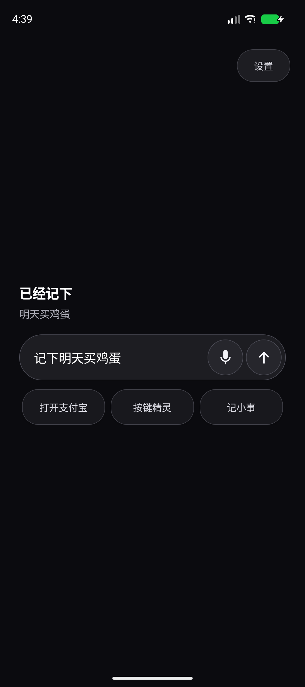
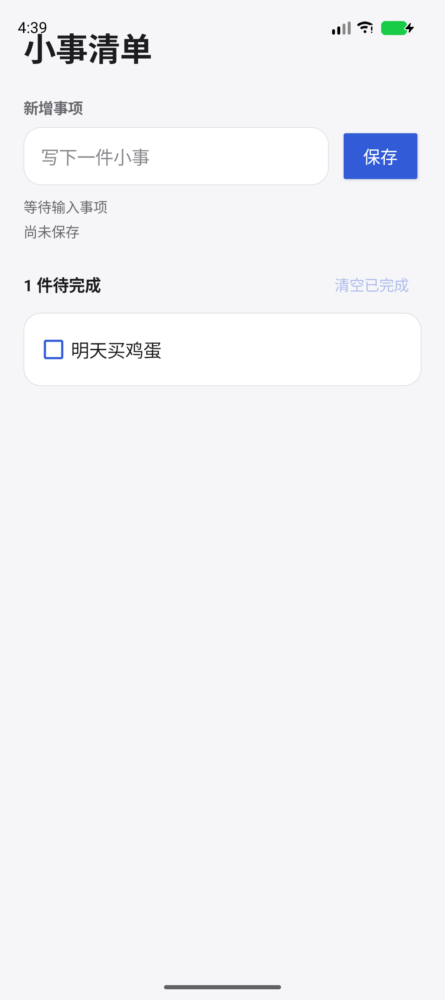
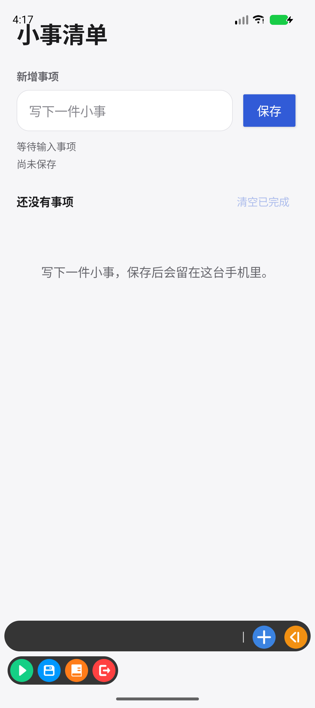
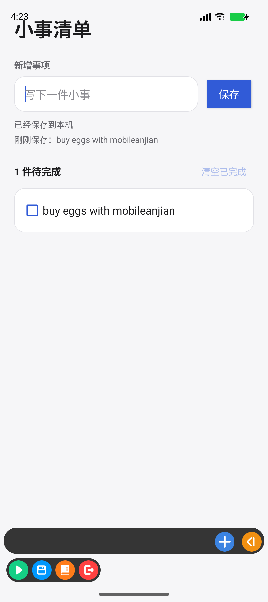

# 三分钟实战：让鸡蛋跨 App 记下一件小事

## 一句话说明

你点一下 **记小事**，鸡蛋会打开自己的“小事清单”，替你写下“明天买鸡蛋”，确认真的保存以后再回到 Shell。

这不是演示动画，也不是让 AI 随便点整台手机。它是一条很窄的真实链路：

```text
一句话 → 鸡蛋理解成“记待办” → 打开自有清单 App
      → 无障碍手填写并保存 → 重新看一眼确认 → 返回 Shell
```

当前阶段可以叫作：**第一条有日常价值、可撤销、能核验的跨 App 小动作。** 它还不是独立操作系统，也不代表已经能操控支付宝、微信或其他第三方 App。

## 路线修订：先培养自己的“亲信手”

这一轮实战把方向定得更清楚了：**内置无障碍手是底座，JCL 是它必须遵守的家规，MCP 是连接不同“脑”和工具的插座。** MCP 可以带来新能力，但不能自行获得系统权限，也不能把陌生插件变成可信执行器。

- 默认把自研语义手练稳：认稳定控件、一次只做一步、做完重新观察、结果不明就停；
- 先在自有、无网络、可撤销的日常 App 里训练，再逐项扩大目标范围；
- 按键精灵等第三方自动化工具作为老师、样本和兼容候选，学习它们的长处，但不把项目命门绑在私有接口上；
- 每接一只新手，都必须重新核对身份、能力边界、后置结果和回执，不能靠自报“我成功了”。

接下来优先训练三个普通人真能用的小本领：准备提醒/闹钟、整理本地文件、填写可撤销的普通表单。每学会一个，再用 JCL 固化成任何“脑”都能调用、但不能越权的动作卡。

## 先装三只 APK

需要 Android 8.0 或更高版本。请使用同一个 CI artifact 里的三只 APK，不要混用不同来源或不同构建的文件。

在解压目录运行：

```powershell
adb install -r -t .\JidanDailyDemo-0.1-debug.apk
adb install -r -t .\JidanAccessibilitySandbox-0.1-debug.apk
adb install -r -t .\JidanShell-0.5-debug.apk
```

如果是在源码目录本地构建，则对应命令是：

```powershell
adb install -r -t .\reference-app\daily-demo\build\outputs\apk\debug\daily-demo-debug.apk
adb install -r -t .\reference-app\accessibility-sandbox\build\outputs\apk\debug\accessibility-sandbox-debug.apk
adb install -r -t .\reference-app\shell\build\outputs\apk\debug\shell-debug.apk
```

## 第一次怎么玩

1. 打开 **Jidan Shell**。
2. 点首页的 **记小事**。这条快捷键等于输入“记下明天买鸡蛋”。
3. 如果 Android 第一次打开无障碍设置，请亲自开启 **鸡蛋辅助操作**。
4. 返回 Shell。原来的动作会自动继续，**不用再点第二次**。
5. 你会短暂看到**小事清单**：鸡蛋填写输入框并点保存。
6. 鸡蛋重新读取页面；只有看到与本轮事项摘要一致的 `saved` 标记，才把结果写成已核验。
7. Android 会尝试自动返回 Shell，Shell 显示**已经记下**。如果系统没有接受返回动作，事项仍已保存，你手动返回即可。

随后从桌面打开**小事清单**，可以亲眼看到“明天买鸡蛋”。点勾选框能完成或撤销，右上方的**清空已完成**只删除已完成事项。

### 0.3 历史 Android 17 模拟器完整实跑

下面三张图来自同一轮首次使用：极简首页、自动保存后返回 Shell、重新打开仍存在的小事清单。不是设计稿，也不是单模块假成功。

<p align="center">
  
  
  
</p>

实跑发现并修复了一个 Android 17 兼容问题：系统会把空输入框的提示词暴露为无障碍 `text`。执行器现在同时检查 `isShowingHintText`，不会再把提示词误认成用户内容，也没有因此放宽到坐标盲点。

## 当前 0.5 首页

0.5 把首页收成**支付 / 手 / 记事**三个图形入口；按键精灵兼容手位于「手」面板中。下表保留 0.3 动作语义，作为本次真实小事证据的历史说明。

| 按钮 | 实际做什么 | 不会做什么 |
|---|---|---|
| 打开支付宝 | 请 Android 打开支付宝入口 | 不填金额、收款人、密码，不声称付款成功 |
| 按键精灵 | 只打开经过静态审计的固定候选版本 | 不调用私有服务、Socket、脚本，不把它当执行器 |
| 记小事 | 在自有无网络清单里保存“明天买鸡蛋”并核验 | 不读取或操作其他 App |

“打开系统设置”和“开始手脑实验”仍可在输入框键入或说出，只是不再占首页快捷键。

## 它为什么比“点到了就算成功”多一步

这条动作有两步：填写、保存。每一步都遵守同一套规则：

- 只认固定包名、同签名、固定版本和固定实验契约；
- 无障碍服务只订阅“小事清单”和合成实验室两个自有包；
- 只按稳定资源 ID 找输入框与保存按钮，不靠旧屏幕坐标；
- 系统接收动作后，必须重新读取页面并检查后置条件；
- Android 内部 Kotlin `DailyNoteBrain` 的 `note_ready` / `saved` 是页面后置条件名；运行时会把它绑定为 `条件名:<本次正文 SHA-256>`，不会只看到一个通用单词就算成功。它们不是对外 JCL Tool 的字段；
- 同一个 `requestId` 再来一次，不会多存一条；同一 ID 换了正文会被拒绝；
- 结果不明时记为未知并停下，不自动连点；
- 清单正文只在小事清单本机存储中保留，Shell 与无障碍回执保存摘要和哈希链。

小事清单没有 `INTERNET` 权限，数据不会由这个 App 主动上传。调试 APK 仍不是商店签名产品，不应拿来托管重要事务。

## 还可以怎么玩合成实验

在 Shell 输入“开始手脑实验”，鸡蛋会打开另一个无网络实验 App，完成假收款人、假金额、假密码、假验证码和假提交五步。它用于测试敏感字段、故障和结果核验，不会连接真实账户或移动资金。

## 按键精灵这只候选手，实战结果是什么

我们在同一台空白 Android 17 模拟器里，走了按键精灵 4.2.3 的可见公开界面：开启它自己的无障碍服务，进入“制作脚本（免 ROOT）→ 快捷开发”，选择**小事清单**。它能打开目标 App 并展示录制浮窗；目标里也真实保存了 `buy eggs with mobileanjian`。

但这一版**没有生成可回放脚本**：执行输入和保存后，黑色步骤栏始终为空，点浮窗保存也没有出现脚本名或回放入口；浮窗本身还是不进入无障碍树的位图/坐标界面。因此本轮只把它保留为可见的 `HANDOFF_ONLY` 候选，没有伪装成已经接通的 JCL 执行器。

<p align="center">
  
  
</p>

这次失败把下一步说清了：要么获得厂商公开、版本化、可鉴权的脚本接口；要么为不同版本做可验收的录制适配。不能因为“看起来像一只手”就让 MCP 参数把它自我升级成可信执行器。

## 当前证据边界

“Shell → 首次系统授权 → 小事清单 → 两步无障碍执行 → 页面核验 → 返回 Shell”曾在 Android 17 隔离模拟器完整实跑。两步分别写入 `PREPARED / RESULT`：系统均接受动作，前后页面摘要发生变化，后置条件均核验通过，最终 `noteSaved=true`。强退并重新打开小事清单后，事项仍存在。这份[0.3 机器可读证据](audits/jidan-android-daily-note-0.3.evidence.json)是历史基线；历史 0.5 小米走查只证明精确的 `94b125…` APK，见[历史真机证据](audits/jidan-xiaoai-directional-benchmark-0.5.evidence.json)；当前授权构建 `a9898b…` 的 Android 17 成功、指令正文隔离和中途断手失败实测见[当前模拟器证据](audits/jidan-0.5-current-authorized-build-emulator.evidence.json)。

开发者可在 `reference-app` 目录运行：

```powershell
.\gradlew.bat --no-daemon `
  :shell:testDebugUnitTest :shell:assembleDebug :shell:lintDebug `
  :daily-demo:testDebugUnitTest :daily-demo:assembleDebug :daily-demo:lintDebug `
  :accessibility-sandbox:assembleDebug :accessibility-sandbox:lintDebug
```

协议与更早的合成实验细节见[《Android 手 + 脑实验》](10-android-hand-brain-lab-zh.md)。
