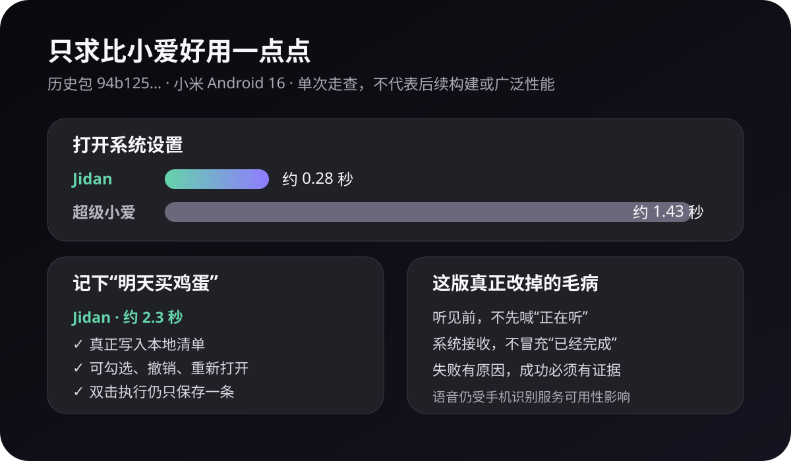
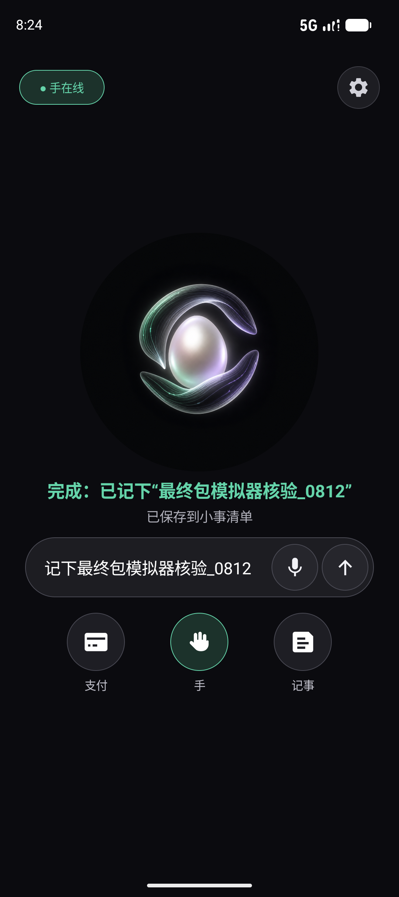
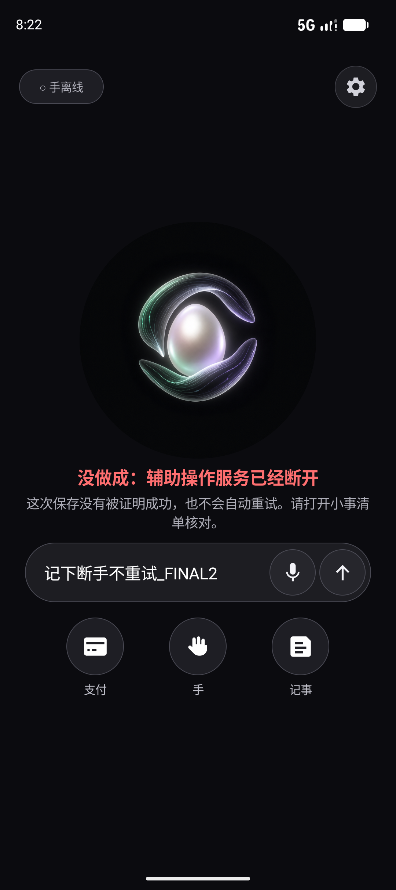

# 从“超级小爱为什么让人着急”到 Jidan 0.5

> 目标不是在发布会上赢，而是在同一台手机上，把一个普通动作做得比小爱好用一点点。



## 网友真正烦的，不只是“答错”

本轮只看普通用户的负面反馈，不采用厂商宣传稿。社区样本不是统计学调查，但几个抱怨反复出现：

- [V2EX 用户讨论](https://cn.v2ex.com/t/899319)提到误唤醒、需要叫两遍、不同设备表现不一致，最后只敢把助手当闹钟用；
- [Tatan 社区帖子及楼中楼](https://bbs.tatans.cn/topic/33271)里，有用户遇到“识别到了、也显示答案，却不出声”，无障碍用户还反馈浮层失焦、按钮没有清楚角色、读屏和键盘操作困难；
- [App Store 用户评论](https://apps.apple.com/cn/app/%E5%B0%8F%E7%88%B1%E5%90%8C%E5%AD%A6/id1436959122?platform=iphone&see-all=reviews)集中抱怨识别不准、听写状态不清楚，不知道它到底有没有在听；
- [V2EX 对超级小爱的近期评价](https://jp.v2ex.com/t/1124761)仍把它形容成较早期的大模型体验；另一个[产品讨论楼](https://fast.v2ex.com/t/1190064?p=2)提到宣传中的游戏能力在实际使用时出现空白结果；
- 用户视频也在质疑[“系统级融合”与实际体验的落差](https://www.bilibili.com/video/BV1ZCkJYYEho)。

Jidan 0.5 因此不追求先回答所有问题，只先遵守五条体验规则：

1. 真正可以收音后，才显示“正在听”；
2. 一句话只执行一次，不再问同义的第二遍；
3. Android 接受启动请求，只能叫“已经开始”，不能叫成功；
4. 页面变化和回执都核对后，才显示绿色“完成”；
5. 没做成就说具体原因，不用漂亮文案掩盖失败。

设置、支付宝和按键精灵目前没有后置页面观察器：离开 Jidan 时显示“正在核对”，返回后会收敛为中性色“已经返回鸡蛋；目标页面结果未核对”，不会永久转圈，也不会变成绿色成功。

## 一次历史真机定向实测

设备为一台小米 Android 16 手机。两边都从干净前台状态开始，通过同样的 ADB 文字输入提交命令，并以目标页面进入前台或可见结果出现为计时终点。每项只做少量定向验证，因此这里只证明 SHA-256 为 `94b125…3108` 的当次历史构建，不把它包装成通用跑分，也不把成绩移植到后来的同名 0.5.0 APK。

| 场景 | 超级小爱 | Jidan 0.5 历史包 `94b125…` |
|---|---|---|
| “打开系统设置” | 约 1.43 秒进入设置 | 约 0.28 秒进入设置 |
| “记下测试：明天买鸡蛋” | 约 2.3 秒出现“小爱记忆”结果卡 | 约 0.4 秒开始填写，约 1.1 秒写入清单，约 2.3 秒返回并显示核验结果 |
| 连点两次执行 | 本轮未测 | 相同请求只保存 1 条，清单总数只增加 1 |
| 结果是否可继续操作 | 记忆结果可在小爱中查询 | 本地清单可勾选完成、撤销、清空，重开仍存在 |

小爱在“记忆”场景并不差：它也在约 2.3 秒给出了真实结果。Jidan 这一轮的优势不是“更聪明”，而是结果直接变成一个可操作、可撤销的小清单，而且 Shell 只在收到保存摘要和哈希回执后说完成。

最终本地授权构建 `a9898b…dfc8` 已另在 Android 17 隔离模拟器复测：安全记事成功；把“打开支付宝并转账”放进记事正文时只保存文字、不嵌套执行；动作中途断开无障碍时保存 0 条并明确失败、自动重试 0 次。截图、三包哈希和测试计数见[当前构建模拟器证据](audits/jidan-0.5-current-authorized-build-emulator.evidence.json)。小米真机 WLAN ADB 随后掉线，所以最终包的真机复验仍明确标为待完成。

<p align="center">
  
  
</p>

## 这次代码路线

下面是已能生成和校验的**协议编译路线**。它目前在编译器处停止，不是当前 Android Shell 的设备执行路径：

```text
用户说话或打字
  → Brain 把目标变成 JCL Hand Intent
  → 编译为与具体工具无关的 Hand IR
  → compiler-only payload
  → STOP：还没有设备消费者
```

当前 Android 真正跑通的是一条独立、固定的 Kotlin 路径：

```text
LocalCommandParser
  → 固定 UiActionPlan
  → 两个钉死身份的自有 Provider
  → 做一步、重新观察、核对结果
  → 只有核验通过才告诉用户“完成”
```

开发态编译器不做支付、密码、验证码关键词过滤；这些内容只作为动作敏感度元数据原样穿过 Intent 和 IR。通用 Hand IR 目前只编译、不连接设备执行器，Android Shell 也没有调用这条 Python 编译链；真机能执行的仍是 Jidan 自有小事清单和合成实验的固定内部 Kotlin 计划。按键精灵 4.2.3 没有可验证的公开命令入口：本轮只确认了可研究的可见脚本文件交接路线，仓库尚未实现 `.mq/.prop` 生成器，更不能把“找到文件格式”冒充“已经执行”。

## 还没有赢的地方

- 历史小米真机走查中，语音服务已经能把 Jidan 带到真实“正在听”，但仍出现识别服务权限错误；失败时 UI 会明确显示“没有听清”，不会伪造文字；
- 当前自然语言 Brain 仍以确定性命令解析为主，离“小爱式自由问答”很远；
- 通用 Hand IR 编译器和 Android Provider 占位已落地，但设备消费者尚未接线，第三方页面的通用观察、规划与回放还没有形成可交付闭环；
- 按键精灵的免 Root QuickDev 使用私有数据库，单纯写脚本文件不能证明能在未 Root 手机回放。

所以 0.5 的结论很小：**在已经支持的动作上，让用户少等一点、少猜一点，并且不被假成功骗一次。** 历史真机与当前模拟器证据分别绑定各自 APK 哈希，互不代替。
