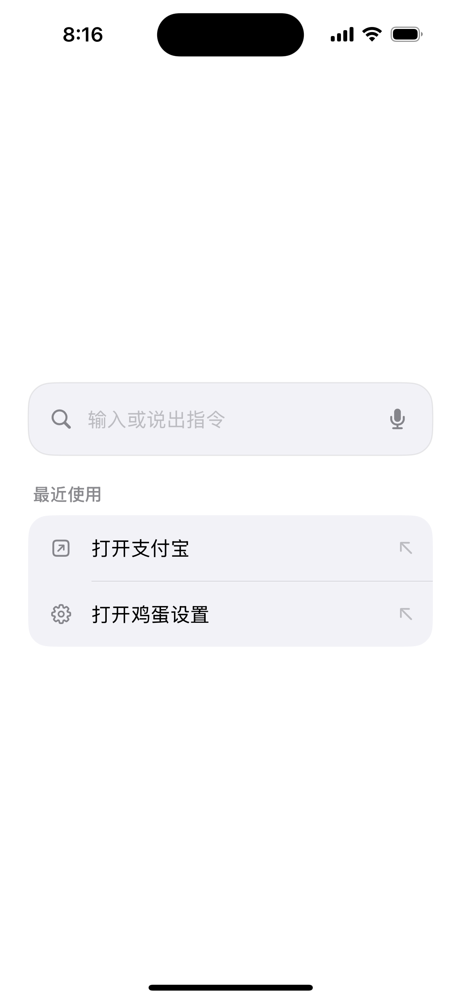

# Jidan iOS Shell 0.1

这是一个真正的 SwiftUI iPhone App 原型：界面、JCL 命令边界与直接导航策略属于 Jidan，iOS 暂时提供内核、沙箱、语音识别和系统入口。它不是一套新的 Apple OS，也不能替换 iPhone 的桌面或越过其他 App 的权限。

<p align="center">
  
</p>

<p align="center">
  <a href="https://github.com/yifangjinxing-hash/jidan/actions/workflows/ios-shell.yml"></a>
</p>

## 普通人能看到什么

- 极简原生首页：一个语音/文字输入框，加上最近使用的快捷指令；
- 跟随 iOS 的系统浅色/深色外观和动态字体，不再使用概念稿式星空、光球或调试文案；
- 点麦克风后，使用 Apple Speech 把普通话转成文字；
- “打开鸡蛋设置”直接进入原生设置页，不弹第二张同义确认卡；
- “打开支付宝”同样不会再问一次，但当前苹果端没有经过审计的公开首页契约，因此如实显示“转接头还没接上”；
- 任何金额、收款人、付款、扫码、密码或验证码语义都在适配器之前停下。

一句话：**进门不盘问，没接上的门不假装打开，动钱要停下。**

## 像安卓模拟器一样观察

仓库的 `iOS Shell CI` 会在 GitHub 的苹果机器上：

1. 固定 Xcode 16.4 与 iOS 18.5；
2. 生成 Xcode 工程并运行 Swift 单元测试；
3. 创建并启动一台 iPhone 16 Simulator；
4. 安装、启动 Jidan，截取全屏主页、鸡蛋原生设置页，以及“支付宝转接头未接上”的诚实状态；
5. 用 XCUITest 像人一样点击两个真实按钮，检查支付宝文案，并确认设置页显示 `JCL 0.1` 和 `NAVIGATION / DIRECT`；
6. 要求每次演示写出对应的可观察状态，并比较画面像素；截图仍像主页，流水线直接失败；
7. 上传截图、测试结果和一个 **仅供 iOS Simulator 使用** 的 `.app.zip`。

在 GitHub 的 Actions 页面打开最近一次 `iOS Shell CI`，下载 `jidan-ios-...` Artifact 就能看到全部证据。Windows 不能本机运行 Apple Simulator；压缩包也不能直接安装到真实 iPhone，真机安装仍需要 Xcode 与 Apple 签名。

## 在 Mac 上运行

需要 Xcode 16.4、iOS 18.5 Simulator 和 XcodeGen 2.46.0：

```bash
cd reference-app/ios-shell
xcodegen generate
xcodebuild test \
  -project JidanIOS.xcodeproj \
  -scheme JidanIOS \
  -destination 'platform=iOS Simulator,name=iPhone 16,OS=18.5'
```

也可以直接用 Xcode 打开生成的 `JidanIOS.xcodeproj`，选择 iPhone 16 后按 Run。

## 诚实边界

- iOS 18.5 Simulator 实测中，Apple 的公开设置 URL 可能只落到“设置 → Apps”列表。因此快捷指令直接打开 Jidan 内的原生设置页；我们不把“设置 App 进入前台”冒充成“目标页已经打开”。
- 经典 `SFSpeechRecognizer` 在部分语言或设备上可能联网；第一次点击麦克风会出现 iOS 必需的权限询问。这是系统权限，不是 Jidan 对同一动作的重复确认。
- 当前不使用网上流传的支付宝私有 URL Scheme。自定义 Scheme 不能可靠证明接收方身份，`open()` 成功也不能证明页面、付款或现实结果。
- 第一版没有后台常听、无障碍坐标点击、OCR 偷点、自动发送或自动付款。
