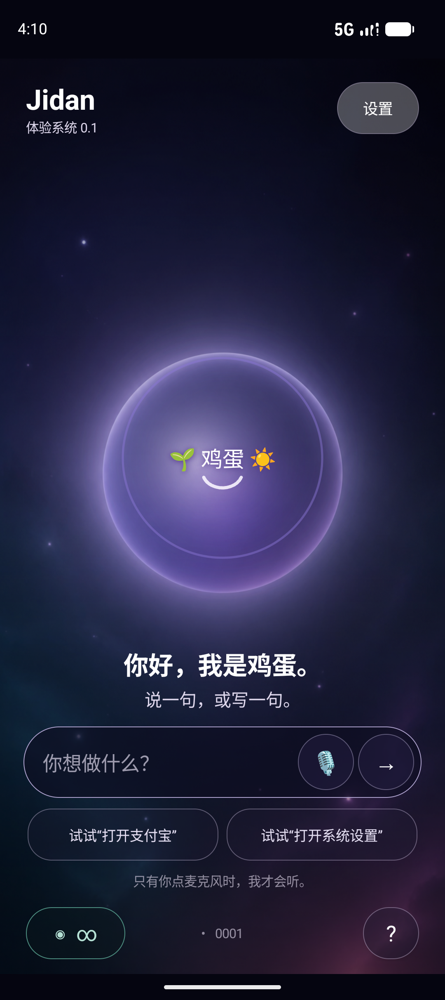

# Jidan Shell 0.1



这是 Jidan 的第一层手机“驾驶舱”：界面、命令边界和本机回执属于 Jidan；Android 暂时提供内核、驱动、语音服务和现有 App 生态。它是可安装的独立 APK，但还不是一套独立 ROM。

## 现在能做什么

- 点快捷按钮、输入或说出“打开支付宝”，直接打开支付宝入口，不重复确认。
- 输入或说出“打开系统设置”，直接交给 Android 打开设置。
- 把手机语音服务的识别结果放进输入框；只有点麦克风后才开始听。
- 拒绝带有转账、付款、金额、扫码、收款、密码、验证码或 URI 的命令。
- 为每次外部转交写一条本机哈希链回执；支付字段始终是 `false`。

这里的规则很简单：**进门不盘问，动钱要停下。** 用户提交“打开应用”本身就是明确授权；它不是付款，也不应再弹一张确认卡。

## 安装体验包

当前输出是调试体验包，要求 Android 8.0（API 26）或更高版本。手机可能提示“未知来源”或“风险应用”，因为它没有应用商店签名。

```powershell
adb install -r -t JidanShell-0.1-debug.apk
```

安装后打开 **Jidan Shell**，可以直接点两个示例按钮。语音转文字是否联网、是否支持离线中文，由手机当前的语音服务决定。

## 本地构建

```powershell
cd reference-app
./gradlew :shell:testDebugUnitTest :shell:assembleDebug :shell:lintDebug
```

APK 输出在 `reference-app/shell/build/outputs/apk/debug/shell-debug.apk`。

## 明确边界

- Shell 只打开支付宝的公开启动入口，不传收款人、金额、口令或私有 URI。
- `handoff_dispatched` 只代表 Android 接收了打开请求，不代表目标页面已出现，更不代表已经付款。
- 当前未审计支付宝安装包签名，因此不能宣称验证了“官方支付宝”身份。
- 它尚未注册为默认桌面，避免体验版崩溃时把用户困住。
- 真正独立的 Jidan OS 仍需要 AOSP、驱动、系统服务、设备适配和长期安全维护。
